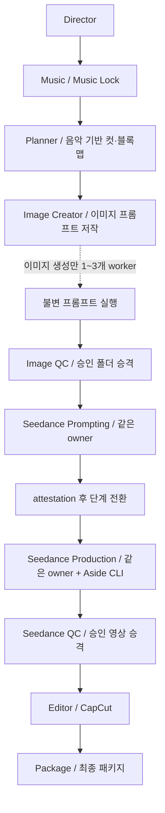

# 영상팀 런타임 규칙 — v4 단일 원본

적용 버전: `2026-07-31-sequential-media-v4`

## 0. 권위와 적용 범위

| 순위 | 문서 | 소유 범위 |
|---|---|---|
| 1 | 이 파일 | 레일, lane 순서, 실행 예산, 미디어 구조, 게이트, 안전 |
| 2 | `~/.codex/skills/seedance-prompt-en/` (2.0/기본) 또는 `~/.codex/skills/seedance25-prompt-en/` (사용자가 2.5 명시) | 선택된 버전의 Seedance 한글 프롬프트 규격과 Runway UI 조작 |
| 3 | `~/.codex/video-team-policies/` | 스폰 승인, 브라우저 오퍼레이터 정책 |
| 4 | `videodirector` | 이야기·연출·품질 기준 |

- 같은 규칙을 여러 문서에 복제하지 않는다. 소유 문서 한 곳에만 본문을 두고 나머지는 포인터만 둔다.
- 프로젝트 안에 규칙 사본을 만들지 않는다. 프로젝트 예외는 `docs/project_overrides.md`에 조항 번호와 함께 기록한다.
- 이 v4 미디어 구조는 **이 버전으로 새로 초기화한 프로젝트에만** 적용한다. 기존 프로젝트는 사용자가 별도 이관을 요청하기 전까지 이동·정리하지 않는다.
- No-I2V는 별도 팀이 아니라 이 전체 레일의 `generation_mode=no_i2v_reference_native`다. 달라지는 것은 이미지/레퍼런스 생성 전략과 Seedance 입력 방식뿐이며, 음악·기획·한글 프롬프트 ownership·QC·media registry·정리·편집·패키지·스폰·안전 규칙은 모두 동일하다.

## 1. 실행 모델: 기본 직렬, 이미지 생성만 최대 3개



1. 기본 레일은 `director → music → planner → image_creator_01 → image_creator_02 → image_qc → seedance → seedance_qc → editor → package`이다.
2. `next --project <p>`가 반환한 가장 앞의 lane 하나만 실행한다. 여러 lane, 여러 프로바이더, 여러 브라우저를 동시에 돌리지 않는다.
3. **유일한 제작 병렬 예외는 이미지 생성 worker 1~3개**다.
   - 하나의 활성 Image Creator lane이 이미 작성·고정한 프롬프트를 worker에 분배한다.
   - worker는 프롬프트를 수정·재작성·보완하지 않는다.
   - worker는 에이전트가 아니라 수명이 제한된 파일 생성 프로세스이며, fan-in 뒤 종료한다.
   - 4개 이상 요청은 `IMAGE_WORKER_CAP_EXCEEDED`로 거부한다.
4. 같은 owner가 직렬 실행하되 영상 생성은 QC보다 우선한다. 제출 가능한 승인 패키지를 먼저 생성하고, provider 대기 시간에 완료 후보를 QC한다. QC backlog는 독립된 다음 패키지 생성을 막지 않는다. 생성 배치 후 남은 QC를 컷 순서대로 끝내며 승인 승격·최종 편집/납품에는 QC를 유지한다.
5. 프로바이더 기본값은 Seedance다. Grok I2V는 사용자가 해당 프로젝트에서 명시했을 때만 같은 직렬 레일 안에서 사용한다. 프로바이더 병렬은 금지한다.
6. 임의 subagent, 전담 프롬프트 agent, 백그라운드 daemon, cron, heartbeat, 두 번째 브라우저 자동화 루프를 만들지 않는다.
7. 별도 Codex owner를 만드는 lane dispatch는 현재 대화의 해당 spawn 승인을 요구하며, runtime은 `--approved-spawn <lane>:<phase>`가 정확히 일치하지 않으면 거부한다. **같은 owner가 다음 lane/phase의 책임을 이어받는 것은 dispatch/spawn이 아니며 추가 승인을 묻지 않는다.** `next`의 `default_execution`이 기본이고 `next_dispatch`는 승인된 별도 owner 생성에만 쓰는 호환 정보다.

### 1.0a 불필요한 확인 금지

- 사용자가 요청한 프로젝트 범위의 프롬프트 작성·검수, 승인 참조의 비공개 생성 입력, 설정 확인, Generate, 재시도 규칙 안의 수정, QC, 로컬 CapCut 편집·export는 같은 owner가 이어간다. 다음 컷이나 단계마다 “진행할까요?”를 묻지 않는다. **Suno 음악은 예외**: 음악감독은 생성까지만 수행하고 다운로드·생성물 평가/추천/선정은 하지 않는다. 세부 생성 경계는 `music-director/SKILL.md`가 소유한다. Seedance 영상 다운로드 등 다른 매체의 승인된 작업은 이 예외로 바뀌지 않는다.
- Seedance의 같은-turn foreground wait는 매 15분마다 새 승인을 받는 작업이 아니다. 대기와 실제 예약의 구분·진단은 선택된 Seedance skill이 소유한다.
- 별도 실행자/실제 scheduler를 처음 생성하는 승인과 결제·로그인·공개 게시·외부 제출·개인정보·비가역 삭제 gate는 그대로다. 역할 표나 포괄적 자동화 선호를 개별 spawn 승인으로 바꾸지 않는다.
- safe same-tab 새 프로젝트 세션 준비는 Seedance `aside-operator.md`의 구체적 보존·확인 조건을 따른다. 이 파일은 UI 절차를 복제하지 않는다.

### 공통 워크플로우 개선과 예약 적용 범위

- 사용자가 작업 중 “지침 반영”, “워크플로우 수정/개선”을 요청하면 명시적 프로젝트 한정 예외가 아닌 한 `video-team-workflow`의 해당 공통 원본을 수정·검증·배포한다. 프로젝트 메모/증거/래퍼 수정만으로 완료를 보고하지 않는다. 절차: 원본 저장소 `docs/video-feedback-promotion-protocol.md`.
- Seedance 생성 우선·예약 확인·다음 승인 패키지 접수·다운로드·대기 중/배치 후 QC은 모든 프로젝트에 적용되는 공통 절차다. 기본 주기·등록·종료·소비 검증의 단일 원본은 선택된 Seedance skill이 참조하는 shared `seedance-production.md`의 Continuation selection/Post-Generate continuation gate다. 이 파일에 UI/예약 절차를 복제하지 않는다.
- 공통 정책 적용과 예약 인스턴스 생성은 다르다. 각 프로젝트는 자신의 작업/큐에 연결된 승인된 예약을 사용한다. 다른 프로젝트 예약을 재사용하거나 현재 HOLD/PAUSED 작업을 공통 개선 명목으로 재개하지 않는다. 새 surface 승인과 안전 게이트는 유지한다.

### 1.0 입력 증거 게이트

- v4 Planner 진입은 `music.status=LOCKED`만으로 통과하지 않는다. 선택된
  `music.asset_id`(또는 정확한 등록 경로), active locked audio, media 내부 실파일,
  hash, 양수 duration/audio codec 증거가 필요하다. 이전 승인 음악을 재사용할 수
  있으나 누락 증거를 보완하지 않고 새 파일로 가장하지 않는다. 단, 사용자가 해당
  프로젝트에서 **음악 없이 이미지·영상 먼저**를 명시한 경우에는 §1.0b의 증거 잠금
  예외만 Planner 진입을 허용한다.
- Suno 생성 직후에는 `music.status=NOT_LOCKED`, Music lane `PENDING_USER_AUDIO`로
  멈춘다. 생성 ID/링크는 음악 잠금이나 다운로드 허가가 아니다. 사용자가 직접
  선택·다운로드한 파일을 별도 후속 작업으로 제공하기 전에는 자동으로 음악을
  가져오거나 평가·추천·선정하지 않는다. 기존 실파일 Music Lock 검증은 유지한다.
- Image Creator 진입은 비어 있지 않은 `multi_reference_block_map.json`의
  `blocks`, 고유 ID와 cut/shot 구조가 필요하다. 빈 `{}`나 Planner DONE 문자열은
  통과 근거가 아니다. 이 두 v4 입력 실패는 `--force`로 우회하지 않는다.

### 1.0b 명시적 영상 선행·오디오 보류

- 기본 음악 우선은 유지한다. 사용자가 특정 프로젝트에서 음악 작업을 중단하고
  이미지·영상 제작만 지시했을 때만 `manifest.audio_plan.mode=
  visual_only_no_audio`와 `delivery_scope=visual_assets_only`를 사용한다. 승인된
  사용자 메시지 ID·프로젝트 범위·목표 영상 길이·`PROVISIONAL` 타이밍을
  기계 검증해야 한다. 승인 근거와 그 SHA-256은 별도 불변
  `docs/visual_only_authorization.md`에 두고 `docs/project_overrides.md`는
  계속 편집 가능한 예외 설명으로 유지한다. 기존 프로젝트의 전체 overrides 해시는
  명시적으로 이관하기 전까지 레거시 검증한다. 누락·변조·임의 선언은 음악 잠금
  대체 증거가 아니며, 잘못된 예외를 일반 Music 작업으로 되돌리지 않는다.
- 이 예외에서 Music lane은 `PENDING`으로 남고 `next`는 이를 건너뛰어 Planner를
  반환한다. Planner는 브리프의 임시 시간표로 컷/15초 소스 블록을 설계하되 음악
  박자·프레이즈·VO 호흡을 측정했다고 주장하지 않는다. 기존의 블록맵·정체성·참조·
  Seedance attestation·실파일 QC 게이트는 유지한다.
- 음악/VO를 만들지 않았다고 무음 WAV나 상태 `LOCKED`를 위조하지 않는다. 승인된
  실파일로 시각 후보·편집 초안·음악 없는 시각 에셋 패키지를 진행할 수 있다.
  Seedance 영상 안의 장면 인과적 현장음·효과음은 선택된 버전 skill의 Audio 설정을
  따른다. 별도 음악/VO 파일을 만든다는 뜻이 아니다. 패키지는
  `VISUAL_ASSETS_ONLY_NO_MUSIC`으로 명시하고, 음악/VO가 완성된 홍보영상이나
  음악 싱크를 주장하지 않는다. 이는 No-I2V 자동 옵션이 아니라 프로젝트 한정 범위 예외다.

### 1.1 생성 모드

- 기본 `standard_i2v`: 계획된 production cut마다 독립 source/styleframe을 만들고 QC한 뒤 I2V 입력으로 사용한다.
- `no_i2v_reference_native`: **레퍼런스 수와 신규 이미지 생성을 최소화하고, 한글 Seedance 프롬프트로 더 많은 shot 구성·blocking·동작·camera·분위기·시간 진행을 해결한다.**
- No-I2V에서도 위의 전체 lane 순서, 최대 3개 이미지 실행 예외, 프로젝트 `media/` 구조, `asset_registry.sqlite`, Music Lock, Seedance/편집/QC/패키지/안전 계약은 바뀌지 않는다. 단, 음악 제외를 사용자가 명시한 프로젝트는 §1.0b가 해당 범위에서 우선한다.
- Planner는 이미 승인·등록된 identity/environment reference를 먼저 재사용한다. 충분하면 신규 이미지는 0개이며, 부족할 때만 최소 provider-safe reference를 만든다.
- No-I2V는 per-cut styleframe/start/end/keyframe을 만들거나 업로드하지 않는다. Reference는 재사용 가능한 identity/environment anchor이고, 최종 한글 prompt가 컷별 구도와 시간적 연출을 담당한다.
- 사용자가 영상팀 진행 중 `No-I2V`를 호출하면 같은 프로젝트의 아직 제출하지 않은 block만 이 모드로 전환한다. 이미 제출된 provider job과 기존 media/provenance는 그대로 보존하며 자동 삭제·재해석하지 않는다.

### 1.2 생성 시간 잠금

- 생성 시간의 선택·변경은 Planner/project workflow가 소유한다. 새 프로젝트의 Seedance 기본 lock은 **15초**다. Seedance 프롬프트 복잡도, 단일 동작 여부, 샷 밀도, final edit trim, Runway의 현재 UI 값으로 시간을 추론하거나 단축하지 않는다.
- Planner는 Seedance handoff 전에 lock을 확인한다. `video-codex-runtime lock-duration`으로 5–14초를 설정하려면 source가 반드시 `user:<evidence>` 또는 `brief:<artifact>`여야 한다. `planner_revision:`은 15초를 재확인하거나 명시적 근거가 반영된 revision을 기록할 수 있지만 혼자서는 단축 권한이 아니다.
- 모든 Seedance pack은 `duration_sec`을 선언하고 `prompt_packet_utils.py attest --project <p>`에서 현재 lock과 일치해야 한다. project 없는 attestation은 제출 권한이 없다.
- **15초는 권고가 아니라 하드 기본값**이다. lock 파일을 수동 편집해 5–14초로 낮추더라도 현재 source가 `user:<evidence>` 또는 `brief:<artifact>`가 아니면 `duration_lock_shorter_without_explicit_user_or_brief`로 gate/attestation/settings verification을 모두 실패시킨다.
- 15초 source의 **사용 가능한 수율**을 우선한다. 한 장면의 카메라·행동·끝 프레임이 좋으면 `SINGLE_CONTINUOUS_SHOT` 하나로 두고 편집 핸들을 확보한다. 사용자 의도와 인과에 맞는 경우에만 연속 컷 2–4개를 `PLANNED_MULTI_SHOT_SOURCE`로 묶는다. 각 scene의 시간, covered cut, reference token, 행동, camera, edit-out을 쓰되 숫자를 채우려고 이질적인 장면을 억지로 묶지 않는다.
- 잠금이 바뀌면 기존 attestation은 무효다. 아직 제출하지 않은 불일치 pack은 `HOLD_DURATION_LOCK_MISMATCH`로 두고 프롬프트의 시간 진행까지 다시 저작·attest한다.
- Runway UI 조작 직전의 visible model+duration 비교 절차는 canonical Seedance skill의 `settings-verify`가 소유한다. 이 파일은 그 UI 절차를 복제하지 않는다.

### 1.3 세션 실행자와 창작 모델 선호

- 실행 모델을 Luna로 고정하지 않는다. 사용자가 고른 현재 세션이 컴퓨터유즈, 이미지 생성 호출, 영상 생성, 다운로드, QC, 편집, 폴더링을 맡는다. 실행 native follow-up에는 model/thinking override를 넣지 않는다. 기존 override로 바뀐 세션은 원래 사용자 선택을 확인해야 하며 null을 복귀 증거로 삼지 않는다.
- 기획·이미지·영상의 창작 저작에는 `gpt-6-astra` / `xhigh`를 선호한다. **기본 실행은 현재 대화의 같은 owner가 사용자가 선택한 실제 세션 모델로 저작·생성·QC까지 직렬 진행**한다. 모델 선호를 별도 agent 생성이나 매 단계 승인 요청의 이유로 삼지 않는다. 실제 저작 모델을 기록하고 Astra가 아닌 결과를 Astra 저작으로 표시하지 않는다.
- 사용자가 특정 산출물에 `Astra만`을 명시했다면 현재 모델이 다를 때 대신 저작하지 않는다. 이때도 자의로 child를 만들거나 일반 제작을 전부 중단하지 않는다. 다른 독립 작업은 계속하고, 해당 산출물만 `HOLD_EXPLICIT_AUTHOR_MODEL`로 남긴다.
- bounded Astra author child는 사용자가 그 **별도 spawn**을 현재 대화에서 역할·목적·산출물까지 특정해 승인한 경우에만 쓰는 선택 경로다. 워크플로우 설치나 일반 “영상팀 실행”은 spawn 승인이 아니다. 승인 없는 상태에서는 child를 제안·요구하는 루틴 체크포인트를 만들지 않는다. 별도 상주 관리자, CLI sidecar, 브라우저 owner, 자동 자기 자신 메시지 전환도 만들지 않는다.
- 호출 준비: `python3 runtime/scripts/author_handoff.py request --project <p> --block <id> --kind planning|image|video --input <project-relative-source> ... --output <owned-output-dir> --approval astra-author:<kind>:<id>`. 이 명령은 native `spawn_agent`용 JSON만 출력하며 모델을 실행하지 않는다. 출력의 실제 model/reasoning_effort/fork_turns 인자를 사용한다. full-history fork 대신 brief·현재 계획·정확한 참조/패키지·거절 피드백의 bounded 파일을 전달한다.
- 승인된 child를 실제 사용하는 경우에만 시작 때 `[아스트라 프롬프팅]`, 복귀 때 `[executor] 세션 모델 유지`를 표시한다. parent는 브라우저를 조작하지 않고 입력 무결성·기존 패키지 상태 등 독립적인 로컬 검증을 수행한 뒤 반환을 기다린다. child는 저작 파일만 수정하고 생성·컴퓨터유즈·추가 spawn을 하지 않는다. Astra-only 요청에서 모델 확인이 안 되면 해당 산출물만 보류하며, 다른 모델의 대행 또는 metadata 이름만 바꾸기는 금지한다.
- 반환 시 parent는 실제 native 호출/반환의 agent 또는 task/turn 식별자·모델 근거와 파일 hash를 기록한다. 자기 선언이나 요청 성공은 저작 완료 증거가 아니다. 관련 skill의 critic/attestation을 통과한 원본 pack을 사용한다.
- 실행 인수증에는 `block_id`, `status=READY_FOR_EXECUTION`, `prompt`, `settings`, `pack`과 순서 있는 `references`를 기록한다. 각 항목은 project-relative `path`와 `sha256`이다. 기존 handoff/attestation에 이 정보를 통합하고 인수 당시 receipt hash를 유지한다. `author_handoff.py verify --project <p> --block <id> --receipt <file> --receipt-sha256 <accepted-hash>`는 파일 무결성만 검증하며 실제 저작 모델·참조 첨부·창작 품질을 증명하지 않는다.
- 실행자는 매 재개 시 다음 block ID와 원본 pack/참조/설정을 다시 읽는다. “두 개씩”은 shelf의 다음 두 eligible block이지 임의 변형 두 개가 아니다. 누락·해시 불일치·다른 block·거절 패키지는 제출하지 않는다. 요약/문장 변경/참조 축소는 저작으로 되돌린다. UI 제출 전 검증·queue-doctor·복구·exactly-once 제출은 선택된 Seedance skill만 소유한다.
- `model_routing.py`의 Astra 저작 경로는 **선택적 새 owner dispatch의 선호값**이다. `next.default_execution`은 모든 lane에서 현재 세션 모델을 상속하며, CLI는 이를 대신 실행할 수 없어 현재 대화로 돌려보낸다. 이미지 lane은 prompting과 production 책임을 구분하되 owner를 강제 분리하지 않는다. 기존 owner 전환 호환 경로는 별도 승인된 경우에만 사용하며 자동으로 Luna를 강제하지 않는다.

## 2. 프롬프트 소유권

### 2.1 저작 책임

- 상주 prompt bridge는 사용하지 않는다. 별도로 승인된 bounded Astra 저작 호출만 §1.3을 따른다.
- Planner는 컷·블록 구조, 참조 역할, 음악 큐, 동작 의도까지만 정의한다.
- lane 이름이 별도 agent 생성 권한을 주지 않는다. 최종 프롬프트는 §1.3의 실제 모델 표시와 이 lane의 검증을 거친 prompting 단계가 소유하고 production 단계는 불변 입력을 소비한다.

### 2.2 이미지

- Image Creator lane이 Gongnyang `image-prompt` 스킬을 적용해 이미지 프롬프트를 쓴다.
- 반복 인물/캐릭터는 승인된 모델시트를 먼저 만들고 실제 참조로 첨부한 뒤 production frame을 생성한다.
- 승인 전 정체성 QC의 현재 세부 기준은 `runtime/references/character_sheet_prompt_standard.md` 한 곳이 소유한다. 모든 인물에 10개 QC 전용 이미지를 습관적으로 생성하지 않는다. 캐릭터가 없는 독립 블록은 다른 인물의 QC 대기와 분리해 진행한다.
- 한 production cut은 한 프롬프트, 한 독립 이미지다. production grid/contact sheet는 금지한다.
- 이미지 실행은 현재 owner의 내장 image_gen 호출이다. `prepare-image-batch`
  (구형 별칭 `dispatch-image-shards`)는 hash-bound 전달 목록만 만들며 process,
  agent, 새 Codex task를 실행하지 않는다. 기존 App Server thread/start bridge와
  참조 이미지의 자동 Image API 전환은 퇴역했다. 참조 누락을 무참조 생성으로
  바꾸지 말고 승인 identity를 실제 첨부·확인한다.
- No-I2V에서는 앞의 두 문장을 per-cut production frame 생성 허가로 해석하지 않는다. 신규 생성이 꼭 필요한 최소 reusable character/environment reference 각각에만 `한 프롬프트=한 이미지`를 적용한다.

### 2.3 Seedance

- Seedance lane이 최종 영상 프롬프트를 **한글(`ko-KR`)로 직접 작성**하고 같은 lane에서 순차적으로 Runway를 실행한다.
- 최종 팩은 `prompt_language=ko-KR`, `prompt_style_version=creative_seedance_ko_v4_20260731`, `authoring_contract=seedance_lane_owned_ko`를 선언한다.
- `prompt_packet_utils.py validate/attest`에서 한글 우세·길이·운영문서 누출·해시를 통과하지 못하면 Runway에 붙여넣지 않는다.
- 최종 Seedance 시각 프롬프트는 먼저 **UTF-8 NFC `*_prompt.txt`**로 저장한다. 한글/비ASCII 입력이나 IME 상태가 불확실할 때 synthetic typing을 재시도하지 않고, 이 txt를 `paste-prompt --file`의 IME-safe paste event로 한 번만 넣는다.
- `~/.codex/skills/seedance-prompt-en/scripts/runway_ui_helper.py paste-prompt`는 `.txt`/UTF-8/NFC/한글 우세를 검사하고, 붙여넣기 뒤 정규화 본문과 해시가 일치할 때만 성공한다. `runtime/scripts/runway_ui_helper.py`는 기존 호출 호환 shim일 뿐 구현 소유자가 아니다.
- 사용자가 현재 요청에서 `Seedance 2.5`/`씨댄스 2.5`를 명시하면 `~/.codex/skills/seedance25-prompt-en/`을 선택하고, 명시적 2.0 또는 버전 없는 Seedance 요청은 `~/.codex/skills/seedance-prompt-en/`을 선택한다. 한 block에서 두 버전 스킬을 함께 읽지 않는다.
- 세부 프롬프트 규격과 Runway UI 절차는 위에서 선택된 한 버전 스킬만 따른다.
- 사용자 제공 Seedance 2.0 프롬프팅 ZIP의 검증된 멀티모달 바인딩·타임 비트·원샷/멀티샷·연장/수정 문법은 `~/.codex/skills/seedance-prompt-en/seedance2-prompt-patterns.md` 포인터로만 참조하며, 별도 경쟁 스킬로 설치하지 않는다.

### 2.4 속성 기반 위키 지식 선택

- 위키는 창작·매체·카메라·QC 지식 저장소지만 Seedance lane이 전체 위키를 읽어서는 안 된다.
- Director가 프로젝트 `medium/project_type`을 분류하고 Planner가 `lanes/planner/video_attributes.json`에 block별 `shot_roles/cameras/risks/methods/audio`를 기록한다.
- Seedance는 prompt 작성 전에 `video-codex-runtime knowledge-select --project <p> --block <BLOCK>`을 실행한다. 로컬 라우터는 `/Users/gnudas/wiki/_meta/video-knowledge-catalog.json`에서 최대 6개 섹션, 기본 9,000자만 골라 context packet과 hash receipt를 만든다.
- 기본 선택은 hot core + 카메라 구도 core + 현재 2D/3D/실사 매체 profile이며, shot/camera/risk/method/audio 문서는 해당 속성이 있을 때만 추가한다. Mixed는 `mixed` 하나로 뭉개지 않고 실제 component media도 함께 선언해 해당 profile들을 선택한다.
- 창작 지식 내부에서는 사용자 최신 지시와 프로젝트/identity/medium lock을 지킨 뒤, `video-prompting-higgsfield-community-grammar`의 camera-first·시간 동사 chain·motion-preset 물리 번역·필요한 만큼의 물리 단서·명시적 end frame을 일반 camera 참고보다 우선 적용한다. 물리 레이어 수를 형식적으로 채우거나 Community prompt 문장·celebrity/IP·preset ID를 그대로 복사하지 않는다.
- 최종 prompt pack과 attestation은 현재 selection ID/context hash를 가져야 한다. 전체 wiki/raw/archive 자동 읽기, 키워드 stuffing, 모델 검색용 background agent는 금지한다.
- 이 라우터는 로컬 파일 선택기이며 agent·scheduler·RAG service가 아니다. Notion 작업 일지는 진행 상태/결정만 저장하며 이 creative knowledge packet에 자동 주입하지 않는다.

## 3. 프로젝트 미디어 단일 저장소

새 v4 프로젝트의 모든 실제 미디어는 프로젝트의 `media/` 아래에만 둔다.

```text
media/
  01_sources_원본자료/
  02_audio_음악/
  03_characters_캐릭터/
  04_images_candidates_이미지후보/
  05_images_approved_이미지승인/
  06_videos_candidates_영상후보/
  07_videos_approved_영상승인/
  08_edit_편집/
  09_final_최종본/
  90_work_작업중/
  99_archive_보관함/
```

- `lanes/<lane>/`에는 프롬프트, JSON/JSONL, 로그, QC, 상태, 결과 같은 **메타데이터만** 둔다. PNG/JPG/MP4/MOV/WAV/MP3 등 실제 미디어를 두지 않는다.
- `asset_registry.sqlite`가 모든 미디어의 `asset_id`, `work_item_id`, revision, attempt, parent, SHA-256, 현재 경로, lane/provider/prompt provenance를 관리한다.
- 파일명·컷 번호는 표시용이며 자산 식별자가 아니다. 이동·승격 뒤에도 `asset_id`가 동일성을 유지한다.
- 생성 직후 후보 폴더에 등록하고, QC PASS/WARN_PASS 뒤에만 승인 폴더로 `promote`한다.
- Seedance 다운로드 MP4는 `06_videos_candidates_영상후보`에 등록하고, Seedance QC PASS 뒤 `07_videos_approved_영상승인`으로 승격한다.
- 잠근 음악은 `02_audio_음악`, CapCut 프로젝트/편집 재료는 `08_edit_편집`, 최종 master/package는 `09_final_최종본`에 등록한다.

### 3.1 미디어 정규화는 하드 게이트

다음 중 하나라도 있으면 v4 lane 실행을 `MEDIA_HARD_GATE`로 거부하며 `--force`로 우회할 수 없다.

- 실제 미디어가 `media/` 밖에 있음
- `media/` 파일이 registry에 없음
- 등록 파일이 사라졌거나 SHA-256이 달라짐
- 승인 자산이 후보/작업 폴더에 남아 있음
- 하류 lane이 요구하는 등록 후보·승인·최종 자산이 없음

`python3 runtime/scripts/media_registry.py audit --project <p>`가 통과해야 진행한다.

## 4. 24시간 중간 파일 정리

### 4.1 중간 파일

다음은 더 이상 활성·정규 자산이 아님이 registry로 확인된 경우에만 중간 파일이다.

- 업로드/가져오기용 staging 복사본
- 실패·거절된 재시도 결과
- 선택되지 않은 후보
- 정규본이 별도로 존재하는 exact duplicate
- proxy, test output
- 상태가 변하지 않은 중복 증거 screenshot

### 4.2 보호 대상

원본, 사용자 지정 참조, 승인 이미지/영상, 잠긴 음악, CapCut 프로젝트, 최종 export/package, 프롬프트, manifest, provenance, QC 기록은 자동 정리하지 않는다.

### 4.3 처리 방식

- 중간 파일은 `90_work_작업중`으로 이동하고 `active=0`과 사유를 기록한다.
- 그 상태로 **최소 24시간** 지난 파일만 macOS 휴지통으로 옮긴다.
- 원래 경로, 휴지통 경로, SHA-256, 사유, 시간을 SQLite와 `cleanup_journal.jsonl`에 남긴다.
- 휴지통을 자동으로 비우거나 영구 삭제하지 않는다.
- v4 프로젝트에서 `project_sweep.py apply`는 이 registry-backed 정책만 수행한다.
- 별도 정리 daemon을 만들지 않는다. 승인된 lane `dispatch`가 모든 시작 게이트를 통과했을 때만 24시간이 지난 eligible 항목을 동기적으로 휴지통 처리한다.

## 5. Seedance 큐 대기와 재개

- 큐 판정, slot 보충, 다음 패키지 무장, same-turn foreground wait, 재확인, 다운로드 절차는 오직 선택된 버전 스킬의 production 문서와 `scripts/runway_ui_helper.py`를 따른다. 2.0은 `seedance-prompt-en/seedance-production.md`, 명시적 2.5는 `seedance25-prompt-en/production.md`이다. 2.5 helper는 공통 구현의 모델 정책 adapter일 뿐이다. CLI의 timer/file은 Codex를 자동 재진입시키는 scheduler가 아니며, 이 파일은 그 절차를 복제하지 않는다.
- 상주 monitor, `watch-generate`, 별도 observer agent/process, 두 번째 브라우저 루프는 사용하지 않는다.
- 로그인, CAPTCHA, 결제, 권한, 계정 제한은 자동 대기로 해결하지 않는다. 정확한 사용자 행동을 적고 BLOCKED한다.

## 6. 제작·QC 공통 게이트

- 음악 우선: BGM/노래의 구조, 박, 프레이즈, 훅, 에너지, 엔딩을 분석한 뒤 컷 타이밍을 잠근다.
- 반복 인물/캐릭터는 모델시트가 승인·등록·첨부 검증되기 전 production frame을 만들지 않는다.
- 원본 still은 최종/review master에 직접 넣지 않는다. 승인된 I2V clip만 사용한다.
- 같은 생성 영상 파일을 타임라인에서 두 번 쓰지 않는다.
- QC는 해부학, 손·물체, 인물 소실, 정체성, crop drift, 반복 샷, jitter, freeze, 1-frame flash, subtitle overlap, line clipping, 전환 handle을 확인한다.
- 실패를 편집으로 숨길 수 없으면 재생성·교체한다.
- 실제 파일 경로·크기와, 영상/음악이면 duration·codec을 확인하기 전 완료로 표시하지 않는다.

## 7. CapCut과 패키지

- 사용자가 CapCut을 요구한 프로젝트는 CapCut draft를 중심 handoff로 유지한다.
- 텍스트 정렬·가독성·효과 강도는 JSON 좌표가 아니라 실제 CapCut preview/export를 기준으로 판정한다.
- final package는 master, clean master(해당 시), 승인 클립, 잠긴 audio, EDL/manifest, review keyframes/contact sheet, notes와 필요한 공개용 copy를 포함한다.
- 최종 export와 package도 registry에 등록되어 `09_final_최종본`에 있어야 package gate가 열린다.

## 8. 안전과 스폰 제한

- 공개 upload/publish, 공모전·정부 form 제출, email send, 개인정보 form submit, payment, password/2FA, 영구 삭제는 명시적 사용자 승인이 필요하다.
- 영상팀에서 별도 agent/lane/subagent/browser loop를 만들려면 현재 대화에서 그 역할·목적·산출물을 명시해 사용자 승인을 받아야 한다.
- 이미지 최대 3개 실행은 §1의 bounded non-agent worker 예외일 뿐, 추가 프롬프트 agent나 browser agent를 허용하지 않는다.
- Seedance 15분 재확인은 §5의 동일 turn foreground wait이며 agent spawn이나 scheduler가 아니다. 대기 결과를 같은 turn이 소비하고 visible board를 재확인하기 전에는 재개 성공으로 인정하지 않는다.
- 문제를 자동으로 고칠 수 있으면 해당 소유 문서의 고정 복구 사다리를 끝까지 수행하고, 해당 항목만 실제 의미 실패하면 다음 적격 항목으로 넘어간다. 특히 Seedance의 도구 timeout·탭 handle 소실·chooser timeout은 업로드 수리 횟수로 차감하지 않으며 선택된 버전 production 문서의 same-session checkpoint 복구 루프를 따른다. 사람·외부 상태가 필요한 문제만 정확한 사용자 행동과 함께 BLOCKED한다.

## 9. 상태·검증 명령

```bash
video-codex-runtime init --mode standard_i2v --brief <brief>
video-codex-runtime init --mode no_i2v_reference_native --brief <brief>
video-codex-runtime set-mode --project <p> --mode no_i2v_reference_native
video-codex-runtime lock-duration --project <p> --seconds <5..15> --source <user:...|brief:...|planner_revision:...>
video-codex-runtime next --project <p>
video-codex-runtime dispatch --project <p> --lanes <one-lane>
video-codex-runtime dispatch --project <p> --lanes seedance --phase prompting --approved-spawn seedance:prompting
video-codex-runtime dispatch --project <p> --lanes seedance --phase production --approved-spawn seedance:production
video-codex-runtime model-route [--project <p> --lane seedance --phase auto]
video-codex-runtime dispatch-image-shards --project <p> --lane image_creator_01 --max-parallel 3
video-codex-runtime shards-status --project <p> --lane image_creator_01
python3 runtime/scripts/media_registry.py audit --project <p>
python3 runtime/scripts/media_registry.py cleanup --project <p> --older-than-hours 24 --apply
python3 runtime/scripts/prompt_packet_utils.py attest --project <p> --pack <prompt-pack.json>
python3 /Users/gnudas/.codex/skills/<selected-seedance-skill>/scripts/runway_ui_helper.py settings-verify --project <p> --block <BLOCK> --visible-model '<visible-model-label>' --duration-sec <visible-seconds>
python3 /Users/gnudas/.codex/skills/<selected-seedance-skill>/scripts/runway_ui_helper.py resume-contract --project <p>
python3 /Users/gnudas/.codex/skills/<selected-seedance-skill>/scripts/runway_ui_helper.py recovery-checkpoint --project <p> --block-id <BLOCK> --session-url <exact-runway-session-url> --reference Image1=<AST_...>
python3 /Users/gnudas/.codex/skills/<selected-seedance-skill>/scripts/runway_ui_helper.py recovery-record --project <p> --block-id <BLOCK> --incident <CODE> [--slot ImageN]
python3 /Users/gnudas/.codex/skills/<selected-seedance-skill>/scripts/runway_ui_helper.py recovery-resolve --project <p> --block-id <BLOCK> [--verified-slot ImageN]
video-codex-runtime validate --project <p>
```

상태·프롬프트·계획·UI 설정만으로 완료를 주장하지 않는다. 실제 미디어와 검증 증거가 완료의 기준이다.

<!-- codex-harness-kit:bridge:start -->
## Codex Harness Activation

This repository uses `codex-harness-kit`.

Keep the existing instructions in this file, and additionally treat `AGENTS.harness.md` as active instructions.

Before making code changes:

1. Read `docs/harness-config.json` first.
2. Use the file paths from the config `paths` object instead of assuming fixed `docs/...` paths.
3. Follow the harness workflow in `AGENTS.harness.md` together with the rest of this file.
<!-- codex-harness-kit:bridge:end -->
