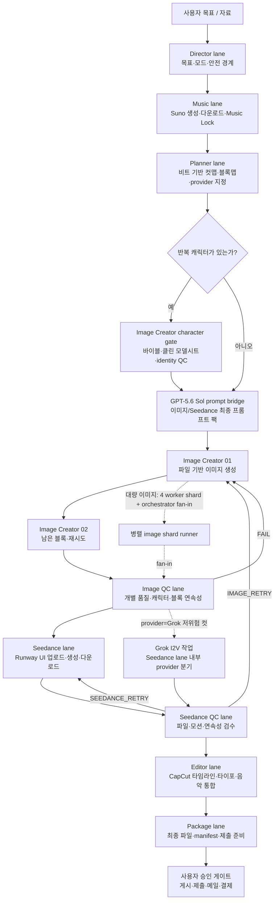

# 영상팀 규칙 — 유일한 원본 (AGENTS.md)

## 권위 순서 (2026-07-28 확정 — 먼저 읽을 것)

이 파일은 **레일·lane·게이트·프로바이더·저작 라우팅·안전**의 원본이다. 하지만 "무조건 이 파일이 이긴다"는 아니다. 그 선언과 `~/.codex/AGENTS.md`의 "Seedance는 스킬을 따르라"가 동시에 존재해 권위가 순환했고, 세션이 어느 파일을 먼저 로드했느냐로 실행이 갈렸다. 아래가 유일한 우선순위다.

| 순위 | 문서 | 소유 범위 |
|---|---|---|
| 1 | **이 파일 (`runtime/AGENTS.md`)** | 레일·lane 순서·게이트·막혔을 때 사다리·프로바이더 배정·프롬프트 저작 라우팅·안전 게이트 |
| 2 | `~/.codex/skills/seedance-prompt-en/` | Seedance 프롬프트 규격, Runway UI 조작, 첨부/Generate/큐/다운로드 절차 |
| 3 | `~/.codex/video-team-policies/` | 스폰 승인 게이트, Chrome 오퍼레이터 모델 |
| 4 | `videodirector` | 기획·연출·품질 기준. **실행 절차를 정의하지 않는다** |

- 2번 범위(Seedance UI·프롬프트 규격) 안에서는 **2번이 이 파일보다 우선**한다. 이 파일에 UI 절차를 새로 쓰지 말고 2번을 고쳐라.
- 1번 범위(레일·게이트·안전) 안에서는 이 파일이 우선한다.
- 같은 항목이 두 곳에 본문으로 존재하면 그 자체가 버그다. 한쪽을 포인터로 바꿔라.
- **프로젝트 폴더 안에 규칙 사본을 만들지 않는다.** 프로젝트 예외는 `docs/project_overrides.md` 한 파일에만, 조항 번호를 인용해서. (독립운동가 프로젝트에서 `SEEDANCE_OPERATING_RULES_CURRENT.md`라는 6번째 권위 레이어가 자생한 사례 — 유효한 교정이 68개 세션 폴더 중 1곳에만 있어서 나머지에서는 적용되지 않았다.)

---

이 파일은 위 1번 범위의 **단일 원본**이다. 규칙 반영 점검은 이 파일과 위 표의 소유자만 보면 된다. 새 규칙은 소유 범위에 맞는 문서에 먼저 쓰고, 다른 곳엔 포인터만 남긴다.

`/Users/gnudas/Documents/Codex/video-team-runtime/runtime/templates/*.md`는 lane 역할·입출력 계약만 담는 얇은 런타임 래퍼다. AGENTS.md의 운영 규칙을 템플릿에 복붙하지 말 것. 템플릿이 필요한 규칙은 `AGENTS.md §번호`로 포인터만 남기고, 중복 본문·옛 외부 워크플로·별도 링크 문서 강제 읽기는 토큰 낭비/충돌원으로 간주해 제거한다.

## 0. 순차 에이전트 모드 (Kanban/프로필/다중-lane dispatch 금지)

- 영상팀은 **순차 에이전트 방식**으로만 운용한다. Kanban 보드/카드, assignee/profile 매핑, 임의 subagent, `delegate_task`, 별도 Hermes 구조는 쓰지 않는다.
- 기본 루프: `next --project <p>` → 반환된 `next_lanes` 중 **가장 앞의 1개 lane만** `dispatch` → 완료/블로커 검증 → 다시 `next`. `dispatch`는 런타임에서 다중 lane 실행을 거부한다.
- `image_creator_01`과 `image_creator_02`도 그룹 alias로 한 번에 띄우지 않는다. `next`가 요구하는 순서대로 하나씩 `dispatch`한다.
- Runway/Seedance의 UI 대기·다운로드 감시는 seedance lane 내부의 단일 오퍼레이터 작업일 뿐, 별도 Kanban/profile 에이전트로 분리하지 않는다. Provider 병렬(Grok)은 §4.5의 좁은 예외다.
- 이전 Hermes/Kanban/프로필 문서가 보이면 참고하지 말고 이 AGENTS.md와 `runtime/templates/*.md`의 얇은 lane 계약만 따른다. `--lanes all`이나 여러 lane 나열은 dispatch용으로 쓰지 않는다.

### 0.1 영상팀 워크플로우와 서브에이전트 구조

여기서 "서브에이전트"는 임의로 생성하는 별도 chat/profile이 아니라, `video-codex-runtime`이 순서대로 실행하는 **lane 단위 Codex 작업자**를 뜻한다. 한 시점에 한 lane만 활성화하며, 점선은 lane 내부에서 허용된 제한적 병렬 작업이다.



| lane/작업자 | 시작 조건 | 주 산출물 | 다음 게이트 |
|---|---|---|---|
| Director | 프로젝트 init | 목적·모드·금지사항 | Music |
| Music | Director 완료 | 실제 Suno 파일, 음악 구조, Music Lock | Planner |
| Planner | Music Lock | 컷맵, 블록맵, provider matrix | 이미지 프롬프트/캐릭터 gate |
| GPT-5.6 Sol bridge | 구조화 block spec 준비 | hash/provenance가 있는 prompt pack | Image Creator 또는 Seedance |
| Image Creator 01/02 | prompt pack·필요 시 character sheet 준비 | 고유 styleframe/start frame 파일 | Image QC |
| Image QC | 실제 이미지 존재 | PASS/RETRY와 `BLOCK_READY_FOR_I2V` | Seedance |
| Seedance/Grok 작업 | QC PASS·provider 지정 | 다운로드된 I2V 파일과 provider 증거 | Seedance QC |
| Seedance QC | 실제 비디오 존재 | PASS/재시도 경로 | Editor |
| Editor | 승인 클립·Music Lock | 검증된 CapCut 초안과 export | Package |
| Package | 최종 export 검증 | 자가완결 패키지·제출 초안 | 사용자 승인 |

### 0.2 별도 No-I2V Reference-Native 팀 경계

컷별 styleframe/start/end/keyframe 없이 **캐릭터 시트 + 배경 레퍼런스만으로** Seedance native multi-reference 후보를 대량 생성·선별하는 실험/운영 팀은 이 I2V 런타임을 느슨하게 수정하지 않는다. 별도 원본과 런타임을 사용한다.

- 원본: `/Users/gnudas/Documents/Codex/no-i2v-team-runtime/AGENTS.md`
- 실행: `/Users/gnudas/.local/bin/no-i2v-runtime`
- 프로젝트 루트: `/Users/gnudas/Documents/Codex/no-i2v-team-runtime/projects/`
- 두 팀의 차이는 이제 시트 업로드 가부가 아니다(§4.3에 따라 기존 I2V 팀도 반복 캐릭터가 나오면 시트를 항상 첨부한다). 차이는 **컷별 styleframe의 필요 여부**다: 기존 I2V 팀은 컷별 styleframe/start frame을 만들어 그것과 시트를 함께 올리고, no-I2V 팀은 styleframe 없이 시트+배경 레퍼런스만으로 native 후보를 뽑는다.
- 두 팀의 queue event, provider provenance, 결과 파일을 섞지 않는다. 기존 팀은 `BLOCK_READY_FOR_I2V`, 새 팀은 `REFERENCE_PACK_READY_FOR_NATIVE_VIDEO`를 사용한다.

## 1. 런타임과 레일

- **프로젝트 컨테이너 의무**: 모든 영상 제작은 `video-codex-runtime init`으로 만든 `video-team-runtime/<프로젝트>` 안에서만 진행한다. 날짜 폴더(`~/Documents/Codex/<날짜>/…/outputs`)에서의 ad-hoc 제작 금지 — 레일·게이트·QC·validate가 전혀 걸리지 않는다(오늘의 자동완성 사례). 이미 ad-hoc으로 시작된 작업은 즉시 init 프로젝트로 이관. 프로젝트 안에 `CURRENT_ROUTE_RULES.md` 같은 로컬 규칙 사본을 만들지 않는다(canonical 위반) — 프로젝트별 예외는 `docs/project_overrides.md` 한 파일에만, AGENTS.md 조항 번호를 인용해서 기록.
- 실행: `/Users/gnudas/.local/bin/video-codex-runtime` — `init / dispatch / status / report / gate / next / validate / kill`
- 레일: director → music → planner → image_creator_01 → image_creator_02 → image_qc → seedance → seedance_qc → editor → package (항상 `next` 기준으로 1개 lane씩)
- "계속/이어가" → 먼저 `next --project <p>` 실행, 출력의 next_lanes/이유대로만 진행.
- 상태 규율: `status.json`의 `status`는 enum만(PENDING/LAUNCHING/RUNNING/DONE/PARTIAL_DONE/PARTIAL_BLOCKED/BLOCKED/FAILED/KILLED/NOT_LOCKED/LOCKED/PASS/FAIL/REWORK_ONLY/READY_FOR_USER_REVIEW). 자유서식은 `detail`로. `validate`로 점검.
- 게이트 총칙: dispatch에서 실제로 막는 건 하류 4개(seedance/seedance_qc/editor/package)뿐이고 `--force`로 통과 가능하다. 상류는 경고만 남고 실행된다. 규율·도구·증거는 품질 장치다.
- **끝까지 만든다 (2026-07-29 복구)**: 예전 규칙 "막히면 원래 되던 단순한 방법으로 진행하고 이유를 기록하라"를 고정 사다리로 교체하면서 **끈기 조항까지 같이 지워버린 것**을 되돌린다. 사다리는 *어떤 방법을 쓸지*를 제한하는 규칙이지 *얼마나 오래 일할지*를 제한하는 규칙이 아니다.
  - **블로커는 그 항목만 막는다. 세션을 막지 않는다.** 사유를 기록하고 다음 eligible 항목으로 넘어간다. 세션 종료는 *남은 항목이 전부 막혔을 때* 또는 *선반이 비었을 때*이지, 첫 블로커에서가 아니다.
  - **빈 슬롯은 미완의 일이다.** 카드가 수락됐고 보드에 여유가 있으면 같은 회차에 다음 패키지를 넣는다. 슬롯을 비워둔 채 멈추는 건 신중함이 아니라 실패다.
  - **`한 번만 클릭`은 씬 단위**다. 같은 씬의 중복 제출을 막는 규칙이지, 이번 세션에 몇 개를 제출할지의 상한이 아니다.
  - **선반을 소진한 뒤에 스케줄러를 건다.** 아직 제출할 게 있는데 스케줄러를 걸면 15분을 그냥 버린다. 깨어나면 → 넣을 수 있는 만큼 다 넣고 → 더 못 넣을 때 스케줄 + 정지.
  - 멈출 때는 둘 중 무엇인지 명시한다: *선반 소진* 또는 *남은 항목 전부 블로킹(각 사유 나열)*.
  - 블록 코드는 **잘못된 제출을 막으려는 것**이지 실행을 멈추려는 게 아니다. 기록하고 계속하는 것이 정상 경로다.

- **막혔을 때 규칙 (2026-07-28 사용자 확정 — 고정 사다리)**: "막히면 알아서 되던 방법으로 뚫어라"는 폐기한다. 그 조항과 스킬 쪽 "폴백을 발명하지 말고 즉시 BLOCKED"가 동시에 살아 있어서, 같은 실패에 대해 어떤 세션은 우회해 산출물을 내고 어떤 세션은 정지했다. 앞으로 각 조작에는 **미리 정해진 사다리**가 있고, 에이전트는 그 사다리만 오르내린다.
  - 레퍼런스 첨부 사다리: §4.3-1.
  - 사다리에 없는 방법을 즉석에서 만들지 않는다. 마지막 칸에 도달하면 해당 블록만 defer/BLOCKED로 남기고 사유와 필요한 사용자 조치를 적는다.
  - 한 블록이 막혀도 다른 블록의 선반 준비·다운로드·QC는 계속한다. 사다리 소진은 그 블록의 정지이지 프로젝트 정지가 아니다.
  - 사다리가 정의되지 않은 새 상황이면 임의 우회 대신 사용자에게 묻고, 확정된 답을 사다리로 이 파일에 추가한다.
- 완료 인정: 실제 파일(경로/크기/duration/codec) + 검증 증거만. 프롬프트/계획/UI 세팅만으로 완료 주장 금지.

### 1-A. 순서 있는 이미지 라이브러리 — 한 프로젝트 한 폴더, 제자리 수정 (2026-07-28)

**정규 라이브러리는 `assets/images_approved/` 하나뿐이다.** 파일명은 `NNN_<SCENE_ID>_<slug>.<ext>`이고 번호는 항상 1부터 빈칸 없이 이어진다.

문제의 실체: 이름 규칙은 원래 멀쩡했다(`001_S01-01_modern_pangyo_daily_life.png`). 깨진 건 **수정 방법**이다. 중간 이미지를 바꾸면 뒤 번호를 전부 밀어야 하는데, 손으로 밀면 그 파일명을 적어둔 매니페스트·큐·프롬프트 팩이 조용히 깨진다. 그래서 에이전트는 문제를 피했다 — 기존 세트를 그대로 두고 옆에 새 폴더를 팠다. `redesign_20260724/ordered_images_v6_s01_restructured`가 그렇게 태어났고, 한 프로젝트가 68개 폴더 + 빈 `assets/`가 됐다.

**그래서 재넘버링은 도구로만 한다** — 참조를 파일과 함께 옮겨야 안전하다:

```
python3 runtime/scripts/sequence_manager.py <command> --project <p> [--apply]

  check                                 번호 중복·빈칸·순서 점검
  replace --slot N --file F             같은 슬롯 교체 (파일명 유지 → 참조 그대로 유효)
  insert  --at N --file F --slug S      중간 삽입 → 뒤 전부 +1 밀고 참조 갱신
  remove  --slot N                      제거 후 빈칸 메움 + 참조 갱신
  renumber                              1..N 연속으로 재정렬
```

- `--apply` 없으면 **드라이런**이다. 무엇이 어떻게 바뀌는지 먼저 보고 실행한다.
- 교체된 구버전은 삭제하지 않고 `_superseded/<timestamp>/`로 보관하며, 그 폴더에 `operation.json`이 남아 되돌릴 수 있다.
- 도구는 프로젝트 안의 `.json/.jsonl/.md/.txt/.csv`에서 옛 파일명을 찾아 새 이름으로 바꾼다. **손으로 `mv` 하지 않는다** — 참조가 끊긴다.
- **버전 폴더 금지**: `ordered_images_v6`, `redesign_YYYYMMDD`, `*_restructured` 같은 형제 폴더를 만들어 순서 세트를 복제하지 않는다. 변경은 정규 라이브러리에서 제자리로 한다. `validate`가 이런 폴더를 경고로 잡는다.
- `lanes/<lane>/`은 **작업 중간물**만 둔다. 승인된 컷은 정규 라이브러리로 승격하고, 거기서만 순서를 관리한다.
- `validate`가 번호 중복은 `SEQUENCE_DUPLICATE_SLOTS` problem으로, 빈칸은 warning으로 보고한다.
- **레일 준수는 이제 코드가 검사한다 (2026-07-28)**: 지금까지 모든 게이트는 상태 문자열·큐 이벤트·레인이 스스로 쓴 카운트만 봤고 파일을 한 번도 확인하지 않았다. `init`이 `assets/*`를 만들어놓고 그 뒤 아무도 읽지 않아, 독립운동가 프로젝트가 `lanes/` 아래 607개 미디어를 쌓고 `assets/`를 비운 채 `validate PASS`를 받았다.
  - `validate`에 **artifact 감사**가 붙었다: `assets/`가 비었는데 `lanes/`에 미디어가 쌓여 있으면 `RAIL_BYPASSED` **problem**(ok=false), 비율이 크게 기울면 warning, DONE 레인의 정규 폴더가 비면 warning. 출력에 `artifacts` 통계(승인 이미지 수·클립 수·산재 파일 수·상위 폴더)가 포함된다.
  - `editor`/`package` **하드 게이트가 실제 파일을 요구한다**: `approved_for_edit_count`가 0보다 커도 프로젝트에 비디오 파일이 하나도 없으면 `CLAIM_WITHOUT_MEDIA`로 막는다. 게이트는 "미디어가 존재하는가"만 보고 위치는 따지지 않는다(위치 규율은 `validate` 몫) — 진행 중 프로젝트를 정리 때문에 막지 않기 위해서다.
  - 산출물을 `assets/`로 승격하는 것은 여전히 레인의 책임이다. 감사는 안 했을 때 보이게 만들 뿐이다.
- **디스크 스윕 (중복/중간산출물 정리)**: `python3 /Users/gnudas/Documents/Codex/video-team-runtime/runtime/scripts/project_sweep.py scan|apply --project <p>`
  - 실행 시점: 블록 QC PASS 확정 후, 편집 완료 후, 프로젝트 마무리 시.
  - `scan` = 리포트만. `apply` = **가역 격리** — 완전 동일(sha256) 중복 사본과 내용물이 프로젝트에 전부 존재하는 오래된 스테이징 폴더(Downloads/SEEDANCE_*, CapCutImport)만 `_sweep_trash_<date>/`로 이동(manifest로 `restore` 가능). 에이전트는 apply까지 자율 실행 가능.
  - **`purge`(실제 삭제)는 사용자 승인 전용** — `--user-approved` 플래그는 사용자만 부여한다(안전 게이트 §5의 영구 삭제 조항).
  - 같은 블록의 구버전 재시도 클립은 리포트로만 표시(superseded 항목) — 삭제 후보 승격은 사용자 판단.
  - 절대 건드리지 않는 것: queues/·locks/·증거 JSONL·approved 이미지·lock 음악·`*_FINAL*`·package/.

## 2. 프롬프트 저작 = GPT-5.6 Sol 전담

- **비캐릭터 이미지 프롬프트와 Seedance 최종 비디오 프롬프트 저작은 모두 `gpt-5.6-sol` 전담이다 (2026-07-28 사용자 확정).** `5.6 Sol`은 Codex 모델 경로로 처리한다.
- 이전에 §2.1이 비디오 프롬프트를 `gpt-5.6-terra` high 전담으로 지정했으나, 제출 전 attestation은 `model=gpt-5.6-sol`을 요구한다. 규칙대로 terra로 저작하면 attestation이 `NOT_ATTESTED`가 되어 제출이 영구 차단되는 한 파일 안의 데드락이었다. Sol로 통일해 해소한다.
- 호출 주체는 런타임이다: `video-codex-runtime prompts --project <p>`가 READY인데 팩이 없는 블록을 찾아 `runtime/scripts/sol_prompt_bridge.py`를 실행한다. 특정 블록은 `--block <B>`, 재저작은 `--force`.
- bridge는 identity lock verbatim·음악·블록스펙·이웃 프롬프트·QC 실패이력·룰북 TIER를 하나의 패킷으로 조립하고 `codex exec --model gpt-5.6-sol` + `model_reasoning_effort="high"`로 저작한다. 산출물은 `*_sol_prompt_pack.json`, `*.sol_provenance.json`, 이미지용 `*.prompt.txt`다.
- **캐릭터시트(`CHAR_*`)는 Sol bridge 금지**: §3a의 캐릭터시트 표준을 image lane이 직접 적용한다. 캐릭터시트와 장면/모션 프롬프트의 저자 책임을 섞지 않는다.
- **버전·인증 gate**: 현재 CLI가 `gpt-5.6-sol`을 실행할 수 없으면 `BLOCKED_SOL_CODEX_UPGRADE_REQUIRED`, Codex 로그인이 없으면 `BLOCKED_SOL_AUTH_REQUIRED`다. LazyCodex/Codex 업데이트 완료 후 새 Codex 세션에서 재시도한다. Claude, 구형 모델, API 키, 손작성 프롬프트로 자동 폴백하지 않는다.
- **provenance 필수**: pack에는 요청 모델, reasoning effort, Codex CLI 버전, thread/event metadata, packet/pack/raw-output sha256을 남긴다. Seedance 제출 전 attestation은 model=`gpt-5.6-sol`, hash 일치, operational leak 없음이 모두 PASS여야 한다.
- **가시성**: bridge는 `[sol image]` 또는 `[sol seedance]`를 출력하고 `GPT56_SOL_PROMPT_AUTHORING_STARTED/COMPLETED` 이벤트를 큐에 남긴다. 결과 보고에는 Sol pack 경로를 적는다.
- bridge가 1회 자동 교정 후에도 JSON/규칙 검증에 실패하면 `SOL_OUTPUT_INVALID`로 차단한다. 자유서식으로 대체하지 않는다.
- 블록맵에 정보가 부족하면 모델에 손편지를 보내지 말고 `lanes/seedance/prompts/<BLOCK>_block_spec.json`에 `block_id/duration_s/aspect/references/story_beat/contracts/avoid`를 구조화해 추가한다. 상세 기계 계약은 `runtime/references/sol_prompting_handoff_standard.md`를 따른다.

### 2.1 Seedance video prompt director — Sol high / creative latitude contract

사용자 교정: Seedance 최종 비디오 프롬프트는 잠금/네거티브/템플릿 반복으로 Seedance의 구도·카메라·장면 생성능력을 억누르면 실패다. **비디오 프롬프팅은 `gpt-5.6-sol` + reasoning effort `high` 전용 패스**로 처리한다(2026-07-28 모델 확정). 이미지 프롬프트·캐릭터시트·CapCut 자막 저작과 저자 책임을 섞지 않는다 — 같은 모델을 쓰되 패스를 분리한다.

아래의 creative latitude 계약(레퍼런스=앵커, 부분적 lock, 하나의 샷 아크)은 원문 그대로 유효하다. 바뀐 것은 저작 모델뿐이다.

- 제출용 Seedance 프롬프트는 Terra high가 `video_prompt_director_high` 역할로 최종 작성/재작성한다. 사람이 임시로 만든 템플릿, Gongnyang 이미지 프롬프트 문장, “Preserve crop/composition… slow push…” 반복문은 제출 전 그대로 쓰지 않는다.
- 목표 길이: **700–1,500자 권장 목표, Runway 하드 최대 3,500자**. Runway 3,500자는 비상 상한일 뿐이다. 긴 운영 지침·파일 경로·중복 네거티브는 provenance/manifest에 두고 생성 프롬프트에 넣지 않는다.
- 레퍼런스는 감옥이 아니라 **앵커**다. `@ImageN`의 이야기 역할·보존할 핵심 피사체·금지할 왜곡만 지정하고, Seedance가 같은 장면 안에서 shot size, camera path, blocking, transition, parallax, atmosphere를 창의적으로 구성할 여지를 준다.
- `preserve exact crop/composition`, `camera locked`, `minimal motion only`는 태극기·얼굴 클로즈업·손/폰/문자/매크로·자글자글 안정화 재시도처럼 필요한 컷에만 부분 적용한다. 일반 역사/장소/군중/풍경 컷에는 `preserve story motif and identity; allow cinematic reframing`을 기본으로 한다.
- 15초 블록은 “네 장의 정지 이미지 순서 재생”이 아니라 **하나의 영상 장면 아크**로 쓴다: `establish → approach/reveal → tactile/action detail → resolution/hold`. 각 비트는 shot header + action + camera + sensory physics + transition을 가진다.
- 안전 tail은 짧게 유지한다: no readable text/logo/watermark, no gore/torture, no malformed or extra Taegeukgi/trigrams, no modern object drift, no texture crawling/line boiling. 금지문은 필수 위험만 남긴다.
- Seedance UI 제출 전 attestation에 `prompt_style_version=creative_seedance_sol_high_20260728`, prompt char count, prompt sha, source ref manifest sha를 기록한다. 이 버전이 없으면 업로드/Generate보다 먼저 프롬프트 재작성부터 한다. attestation의 `model`은 §2와 동일하게 `gpt-5.6-sol`이어야 PASS다.


Seedance final prompts must contain only video-relevant viewing instructions. Do not mention how a still was made (`Gongnyang`, imagegen, source frame, prompt pack, provenance, QC). Do not assign a reference to an invisible historical/admin label such as a village name unless that location is visually legible or necessary for motion. `@ImageN` roles should be framed as visible function: ember detail, ridge beacon, memory reflection, hands preparing cloth, market lane, crowd wave, aftermath hold.

## 3. 이미지 생성 (Codex 앱 백그라운드 — 원래 방식)

- 표준: `~/.local/bin/video-image-cli`(= `codex_app_image_cli.py`, provider `codex-app-server-imageGeneration`, 코덱스 로그인 auth, API 키 불사용)를 lane runner로 백그라운드 실행:
  `video-codex-runtime next --project <p>`로 다음 이미지 lane을 확인한 뒤, 반환된 lane 1개만 `dispatch --lanes <lane>`로 실행한다.
- 이미지 worker가 여는 app-server thread는 반드시 `ephemeral=true`와 비사용자 `threadSource`를 사용한다. 이미지 파일만 회수하는 작업을 persistent/user-facing thread로 만들면 Codex desktop의 Browser/IAB가 세션을 소유하면서 브라우저 창을 맨 앞으로 끌어올 수 있다.
- `scripts/video_image_cli.py`(OpenAI/Gemini/FAL API 키 계열)는 표준 아님 — 사용자 승인 없이 금지.
- 브라우저/ChatGPT 웹/Computer Use로 이미지 **생성** 금지 — 이미지 생성만은 백그라운드 CLI 경로 전용. (Computer Use 자체는 Runway 제출과 CapCut 편집에 허용 — §4.1, §4.6 참조.)
- **종횡비는 의도 기반**: 레퍼런스별 메타 `aspect_ratio` > manifest > landscape. QC는 선언된 경우에만 강제.
- **레퍼런스 조건부 생성(캐릭터시트 첨부) — imagegen 스킬 경로가 표준 (사용자 승인 2026-07-06)**: 시트를 첨부해서 스타일프레임을 만들 때도 GPT 웹 금지는 그대로다.
  - 표준 경로: **imagegen 스킬** (`~/.codex/skills/imagegen/scripts/image_gen.py`) `edit` 모드 — `edit --image <시트1.png> --image <시트2.png> --prompt <컷 프롬프트> --input-fidelity high --quality high --out <o>`. `--image` 반복으로 멀티 시트 첨부, `input-fidelity high`가 identity lock 용도. 이 용도(시트 조건부 스타일프레임/QC 재생성)에 한해 `OPENAI_API_KEY` 사용이 승인된 예외다.
  - runner/샤딩 경유: 프롬프트 옆 사이드카 `<reference_id>.refs.json`(시트 절대경로 배열)을 두면 runner가 자동으로 imagegen edit 경로로 전환하고 provenance(`reference_images`)를 기록한다 — §3a-1 첨부 검증은 이 필드로 충족.
  - 시트 없는 일반 생성은 기존 표준(코덱스 앱 `video-image-cli`) 유지. 코덱스 앱 `--ref` 첨부는 실험 후보(작동 확인 시 전환 가능).
  - imagegen 경로가 에러(키 미설정 등)면 GPT 웹으로 새지 말고 `BLOCKED_IMAGEGEN_EDIT_FAILED`로 차단 + 에러 원문 보고. `*_chatgpt_upload_staging`류 패키지는 만들지 않는다 — 기존 것은 refs.json 사이드카로 변환해 재실행.
- QC PASS 시 `BLOCK_READY_FOR_I2V`가 자동 발행되어 Seedance 게이트가 열린다.
- **대량 컷 병렬 샤딩 (§0 순차 모드의 공인 예외 — 이미지 단계 한정)**: 기획이 **10컷 이상**이면 이미지 생성을 순차로 돌리지 말고 샤딩한다.
  1. 전제: Sol 프롬프트(`prompts` 명령)가 전부 materialize된 후.
  2. 실행: `video-codex-runtime dispatch-image-shards --project <p> [--shard-size 10] [--max-parallel 5]` — 미생성 레퍼런스를 10개 단위 샤드로 나눠 **분리된 백그라운드 runner를 샤드당 1개** 병렬 기동(슬롯 스트라이프 락으로 동시 생성 수 제어, 50컷 = 5샤드 동시). 이것은 다중 lane dispatch가 아니라 image_creator lane 내부의 작업 분할이므로 §0과 충돌하지 않는다.
  3. **오케스트레이터(현 세션)의 취합**: `video-codex-runtime shards-status --project <p>`로 진행 확인 — 전 샤드 완료 시 자동으로 lane status/manifest에 fan-in(DONE/PARTIAL_BLOCKED)되고, 각 샤드가 `image_review_queue`에 직접 발행하므로 image_qc는 평소처럼 이어가면 된다. 실패 샤드는 `shards/*.result.json`의 failures를 보고 해당 레퍼런스만 재샤딩.
  4. 수동 다중 세션 분할도 같은 방식으로 안전: 샤드 manifest(`lanes/<lane>/shards/shard_NN.json`)를 세션별로 하나씩 맡기면 된다(작업 목록·상태 파일이 샤드 단위로 분리돼 충돌 없음).

### 3-1. 고용량 이미지 생성 — 4 worker + 1 orchestrator fan-in contract

- **트리거**: 이미지 생성 대상이 기본 **8개 이상**인 대량 배치. 1–7개는 4세션으로 쪼개지 않고 단일 image lane에서 처리한다. 이 규칙은 이미지 생성 단계에만 적용하며 Seedance/CapCut 실행을 병렬화하지 않는다.
- **이것은 에이전트 팬아웃이 아니다 (2026-07-28 명확화)**: 여기서 worker는 별도 Codex 챗/에이전트 표면이 아니라, 런타임이 `image_creator_lane_runner.py`를 **분리 실행하는 CLI 프로세스**다. 하나의 image lane 안에서만 일어나는 병렬화이므로 §0.1 스폰 승인 게이트(에이전트/lane/모니터/브라우저 루프 확산)의 대상이 아니다. 다만 **자동 발동도 아니다** — `next`는 샤딩을 제안하지 않고, 사람이 `dispatch-image-shards`를 명시적으로 실행해야 시작된다.
- **세션 구조**: 현재 세션은 하나의 **오케스트레이터**로 유지하고, 순서가 고정된 불변 manifest를 최대 **4개의 격리된 worker 프로세스**(`shard_01`–`shard_04`)로 분배한다.
- **worker 격리**: 각 worker는 자기 샤드의 `lanes/<image_lane>/shards/shard_NN/` 안에만 출력·result·provenance·failure를 기록한다. 1컷=1프롬프트=1 standalone image를 지키며, 공용 planner/manifest 수정, 다른 샤드 파일 수정, Seedance 제출, CapCut 실행, 프로젝트 완료 선언을 하지 않는다. 런타임 CLI의 동시 실행 상한은 `--max-parallel 4`이며 이것이 코드 기본값이다. `--shard-size`는 기본 auto(= 대기 수 ÷ 병렬 수)라 8개 배치도 실제로 4워커로 갈라진다 — 예전 고정값 10에서는 8개 배치가 샤드 1개가 되어 병렬이 전혀 걸리지 않았다.
- **오케스트레이터 preflight**: 시작 전에 cut ID/파일명/순서, prompt·reference hash, 샤드 할당, character-sheet attachment 여부를 고정한다. worker 결과를 주기적으로 수집하되, 경로·파일 크기·dimensions·provenance·prompt hash·중복 파일명/콘텐츠를 실제로 검증한다.
- **fan-in gate**: 검증된 결과만 하나의 ordered manifest와 `image_review_queue`로 합치고, contact sheet 및 QC summary를 생성한다. 성공한 샤드를 통째로 재실행하지 말고 실패 ID만 재샤딩한다. 부분 실패는 반드시 `PARTIAL_BLOCKED`와 failure list로 남긴다.
- **one-way 복귀**: fan-in과 Image QC PASS 전에는 어떤 worker도 Seedance를 제출하지 않는다. fan-in 이후 worker 세션을 종료하고, 오케스트레이터가 정상 순차 흐름 `image_qc → Seedance → Seedance QC → editor`로 복귀한다.
- **캐릭터시트 예외 없음**: 고용량 배치라도 §3a/§3a-1의 identity lock, 승인 시트 첨부, attachment 검증 규칙이 우선한다. 첨부를 검증할 수 없는 컷은 생성 성공으로 간주하지 않고 해당 ID를 명시적 blocked로 남긴다.

## 3a. 캐릭터시트 표준 체인 (CHAR_* / 캐릭터 바이블 / turnaround / model sheet)

트리거: `CHAR_*` 레퍼런스, "캐릭터시트/캐릭터 시트/character sheet/character bible/캐릭터 바이블", 반복 주인공·마스코트 승인 요청. 이때는 예외적으로 아래 문서를 **직접 읽는다** (AGENTS.md 단일화의 명시적 예외):

1. **1순위 — 사용자 승인 최신 표준**: `/Users/gnudas/wiki/concepts/character-bible-page-prompt-standard.md` — AAA 바이블 페이지 표준 + **2종 출력 규칙**(① 고밀도 캐릭터 디자인 바이블 페이지: hero pose·turnaround·expression·의상/소품 callout·팔레트·lore, ② Seedance/I2V identity lock용 클린 프로덕션 시트: 중립 배경·플랫 조명·무텍스트).
2. **2순위 — 클린 프로덕션 시트 세부 규격**: `/Users/gnudas/Documents/Codex/video-team-runtime/runtime/references/character_sheet_prompt_standard.md` (CHAR_TURNAROUND/EXPRESSIONS/POSE_ACTION/PROP_COSTUME 레이아웃, 네거티브 블록).
3. **역할 계약 참고**: `~/.codex/skills/videodirector/references/role-split.md`의 Character Creator 항목.

규칙: 프롬프트 저작은 위 표준대로 lane이 직접(Sol bridge 금지 — bridge도 CHAR_*를 거부한다). **실행 경로는 §3의 표준 CLI 백그라운드 생성** — 스킬 문서에 남은 "ChatGPT Image 2 웹 브라우저" 문구는 legacy이며 본 파일이 이긴다.

**완성 시트의 용도 (2026-07-28 정정)**: 2종 출력 중 ②클린 프로덕션 시트는 애초에 **Seedance/I2V identity lock을 위해** 만드는 물건이다. 따라서 반복 캐릭터가 등장하는 Seedance 생성에는 ②를 장면 레퍼런스와 함께 **항상 첨부**한다(§4.3).

- **①고밀도 바이블 페이지는 어떤 경우에도 Runway에 올리지 않는다.** 텍스트·라벨·콜아웃·패널 격자가 생성물을 오염시킨다. 승인·설계 잠금 전용이다.
- 올리는 것은 ②뿐이다: 중립/오프화이트 배경, 플랫 조명, 읽히는 텍스트 없음, crop-safe. no-I2V 팀의 `PROVIDER_SAFE_REF` 등급과 같은 기준이다.
- ②는 컷별 styleframe을 **대체하지 않는다**. 표준 I2V 팀은 여전히 시트를 조건으로 styleframe을 만들고, Seedance에는 `styleframe + ②`를 함께 올린다.

> 이전에 이 문단은 "완성 시트는 Seedance 입력물이 아니다"로 끝났다. 같은 문단이 인용하는 표준은 ②의 존재 이유를 "Seedance/I2V identity lock용"이라고 정의하므로, 그 문장은 ②를 무용지물로 만드는 자기모순이었다. 금지 조항은 원래 no-I2V 팀과의 경계를 긋기 위한 것이었는데(그 팀만 시트를 직접 올린다), 표준 I2V 팀 쪽으로 번져 첨부 자체를 막았다.

### 3a-1. Character-sheet-first hard gate — 2026-07-06 correction

If a project has recurring humans/characters, the lane must not create production styleframes before the relevant character/model sheets exist and have QC evidence. A single front hero image or a first-pass styleframe is not a character lock. If this mistake is discovered after frames exist, mark those frames `HOLD_LOOKDEV_ONLY`, exclude them from Seedance/Grok handoff, generate the missing MAIN/supporting sheets, and regenerate dependent styleframes with the sheets attached/referenced. Supporting recurring pairs (e.g. couple, guardians) need mini-sheets before their linked cuts.

Current `오늘의 자동완성` continuation rule: MAIN / COUPLE / GUARDIANS sheets are the identity lock. Every regenerated styleframe prompt or manifest must state which sheet(s) were used. If attachment/reference use cannot be verified, classify the cut as `BLOCKED_CHARACTER_SHEET_ATTACHMENT_NOT_VERIFIED`; do not quietly proceed. Pre-lock frames are lookdev only and cannot enter Seedance/Grok handoff.

## 4. Seedance 실행 (Runway UI-only)

### 4.1 경로 고정
- **Runway는 절대 MCP/커넥터/API 금지.** 제출·폴링·다운로드 전부 로그인된 **Chrome** `app.runwayml.com` 생성 보드 탭 하나에서만. 같은 프로젝트로 Safari Runway 세션을 병행해 열지 않는다. 세션 시작 시 보이는 UI(모델 Seedance 2.0/Multi-reference/Unlimited relaxed 모드)를 `provider_route_verification.json`에 기록.
- 로그인/토큰 만료 = `BLOCKED_RUNWAY_LOGIN_REQUIRED` (API 우회 금지).
- **인증 판단의 신호원은 오직 보이는 웹 UI다**: Chrome에서 `app.runwayml.com` 생성 보드가 열리고 계정/팀이 보이면 인증 OK. 로그인 페이지가 보일 때만 BLOCKED. **Runway MCP/커넥터의 토큰 상태를 확인하는 행위 자체를 금지한다** — 커넥터 `oauth_token_invalid_grant`류는 웹 세션과 무관하며, 이를 Runway 블로커의 근거로 쓰는 것은 허위 블로커다(오늘의 자동완성 사례: 커넥터 토큰 만료를 3회 확인하고 Grok 전량 폴백 — 웹 세션은 멀쩡했음).
- **`System Status` 배너 단독 차단 금지**: `We've identified a problem...` 같은 전역 배너가 보여도 로그인된 생성 보드·실제 file input·Generate 버튼이 살아 있으면 먼저 §4.3의 현재 canonical 업로드를 그대로 실행한다. 배너만 보고 `BLOCKED_PROVIDER_OUTAGE`로 분류하거나 Asset selector/파일명 검색/임의 루트를 만들지 않는다. 현재 canonical은 2026-07-19 회귀 교정 이후 **Finder-frontmost 직접 drag/drop**이다. 예전 `input[type=file] → picker-go → 업로드` 성공 기록은 historical fallback evidence일 뿐 기본 경로가 아니다. canonical 레퍼런스 1개 업로드가 실제로 실패하고, 다시 fresh capture한 보드에서도 업로드/Generate 오류가 보일 때만 provider incident blocker로 승격한다.

### 4.2 Seedance 단일 lane 큐 운용 (Kanban/profile 에이전트 아님)
- seedance lane이 활성이고 Runway UI 슬롯이 비어 있으며 준비된 블록이 있으면 **즉시 제출** — 단, 조작 주체는 seedance lane 1개뿐이다.
- 생성 대기 중엔 **선반 준비**: 다음 블록들의 Sol 팩 + 업로드 스테이징 + 오퍼레이터 카드를 미리 완성한다. 이 준비는 seedance lane 내부 작업이며 별도 에이전트를 띄우지 않는다.
- **슬롯 해제 모니터링 (15분 주기)**: 제출 후에는 15분에 한 번 Runway 생성 보드를 확인. **Generate 버튼 활성/비활성 판정은 사용자 최신 정정에 따라 보이는 버튼 색상만 사용한다** — 파란 Generate 버튼 = 누를 수 있는 활성 상태, 회색 Generate 버튼 = 비활성/대기 상태이므로 클릭 금지. AX `disabled`/`aria-disabled`/`data-soft-disabled`나 DOM 추정이 버튼 색상과 충돌하면 색상이 우선이다. 각 폴링은 `ui_evidence.jsonl`에 1줄 기록(ts, 버튼 색상 blue/gray, 보이는 in-flight 수). 폴링 사이 시간은 선반 준비에 사용, 15분보다 촘촘한 상시 감시 금지.
- **모니터링 실행 방식 — goal/상주 에이전트 불필요**: 판정은 스크립트가 스스로 한다.
  `python3 /Users/gnudas/Documents/Codex/video-team-runtime/runtime/scripts/runway_ui_helper.py watch-generate --interval 900 --max-hours 6 --event-queue <project>/queues/retry_router_queue.jsonl --evidence <lane logs>/watch.jsonl`
  — 15분마다 보이는 Generate 버튼 색상을 확인한다. **전제 조건 2가지를 먼저 확인한다(2026-07-28)**: ① 워처는 Runway 탭이 실제로 열려 있는 브라우저를 자동 탐지한다(`RUNWAY_BROWSER`로 강제 지정 가능) — 스크립트가 Safari 고정이던 탓에 Chrome 전환 후 엉뚱한 브라우저를 읽고 `JS_ERROR` 5회로 죽던 문제를 해소했다. ② Chrome은 `View > Developer > Allow JavaScript from Apple Events`가 켜져 있어야 하고 Terminal/Codex에 Automation 권한이 있어야 한다. 꺼져 있으면 워처는 즉시 `BLOCKED_BROWSER_JS_PERMISSION`(exit 5)으로 멈추고 필요한 조치를 출력한다 — 폴링으로 풀리지 않으므로 헛돌지 않는다. **파란색 감지 시**: `SLOT_FREED_GENERATE_BLUE` 이벤트 기록 + macOS 알림 + **exit 0으로 종료**. 회색이면 inactive/wait로 기록하고 클릭하지 않는다. DOM/AX 속성은 색상 판정을 대체하지 않는다. Codex exec에서 단순 `nohup ... &`로 띄운 자식 프로세스는 명령 종료 후 정리될 수 있으므로, 워처는 `subprocess.Popen(..., start_new_session=True, stdin=DEVNULL, stdout/stderr=log)` 또는 동등한 launchd/완전 분리 방식으로 띄우고 `watch_generate.pid`에 기록한다. 단발 확인은 `check-generate`(exit 0=파란색). Codex goal 기능·상주 세션은 이 용도에 사용하지 않는다.
- **PRE-ARM 필수 (버튼 감시의 전제조건)**: Generate 버튼은 큐 만석뿐 아니라 **컴포저가 비어 있어도 회색**이다. 빈 보드를 감시하면 슬롯이 풀려도 영원히 회색 = 무한대기.
  - **다음 블록이 있으면(선반 잔여)**: watch를 켜기 **전에** 다음 블록을 컴포저에 미리 장전 — 레퍼런스 attach 완료(스트립 IMG_n 순서 확인) + Sol 팩 프롬프트 삽입(카운터 확인) + 설정(duration/aspect/resolution)까지. 이 상태에서 회색 = 순수하게 "큐 만석", 파란색 복귀 = 즉시 제출 가능. 파란색 감지 후에는 대기 중 세션 드리프트 가능성이 있으므로 **pre-flight 1회 재확인**(스트립/카운터/설정 유지) → attest → Generate 단발.
  - **이미 파란색이면 watch는 발화하지 않는다**: 기본 동작은 `회색 → 파란색 전환` 대기다. 워처를 켤 때 이미 파란색이면 전환이 일어나지 않아 `--max-hours`까지 조용히 대기한다. 이 경우 워처는 `IDLE_ALREADY_BLUE` 증거와 알림을 남기므로, 지금 바로 제출하거나 `--immediate`로 재실행한다.
  - **큐가 비었는데 다음 블록이 남아 있으면 그것이 제출 신호다** (2026-07-28): observer는 감시자일 뿐 생산자가 아니어서, 계약이 "큐가 끝나면 observer 제거"로만 되어 있으면 큐가 비는 순간 다음 블록을 넣을 주체가 사라진다. 실제로 `큐/로딩 0` + `레퍼런스 0장` 상태에서 observer가 자기를 삭제하고 생성이 멈췄다. 큐가 비면 **먼저 선반을 확인해 PRE-ARM → 프리플라이트 → Generate 1회**로 큐를 채우고, 선반까지 소진됐을 때만 observer를 내린다. 내릴 때는 "선반 소진"을 명시 보고한다.
  - **예약 옵저버 지시문에 씬 정보를 박지 않는다 (2026-07-29)**: 15분 옵저버는 **반복** 작업이라, 지시문에 넣은 씬 ID·프롬프트 문자열·레퍼런스 목록·`keep waiting for user repair` 같은 문구가 매 회차 그대로 재실행된다. 실제 사고: `E24`와 확인할 한글 문장을 지시문에 박아둔 옵저버가, E24 프롬프트의 한글 누락을 8회 연속 확인만 하고 그 다음 에피소드는 한 번도 시도하지 않았다. 지시문은 **무엇을 할지**만 담고, **무엇이 현재인지**는 깨어날 때 프로젝트 상태·선반에서 읽는다.
  - **막힌 패키지는 건너뛴다**: 패키지가 자체 프리플라이트에 실패하면 그 패키지에 사유와 필요한 복구를 기록하고 **같은 회차에 다음 eligible 패키지로 넘어간다**. 씬 하나가 큐를 붙잡는 일은 없다.
  - **사람이 손대야 하는 블로커는 폴링 대상이 아니다**: 폴링으로는 누락된 문구를 입력할 수 없다. 1회 기록 + 정확한 조치 안내 + 사용자 보고 후 그 조건의 재확인을 멈춘다. 변하지 않는 블로커를 계속 확인하는 것은 감시가 아니라 정체다.
  - 표준 옵저버 지시문 템플릿: `seedance-prompt-en/seedance-production.md`.
  - **다음 블록이 없으면(선반 소진)**: 버튼 감시 금지(무한대기). 대신 **완료 감시 모드**: 15분 주기로 세션 보드의 job card 상태(Generating → 완료 썸네일/재생 가능)를 확인, 완료 클립 다운로드 → ffprobe → `seedance_review_queue` 발행, 모든 in-flight 완료·다운로드 시 감시 종료.
- **신호 체인 고정 (감시 대상 역전 금지)**: 신호는 오직 **Runway UI**다. 두 신호를 섞지 않는다.
  - **슬롯 해제/다음 제출 신호**: PRE-ARM 상태에서 회색이던 Generate 버튼의 **파란색 복귀** → pre-flight 1회 재확인 → attest → Generate 단발 클릭 → 새 job card `In queue`/`Generating` 확인.
  - **완료/다운로드 신호**: 세션 보드의 기존 job card가 완료 썸네일/재생 가능 상태 → **그때** 다운로드 실행 → ffprobe 검증 → `seedance_review_queue` 발행.
  - 다음 블록이 선반에 있으면 다운로드/QC가 백필 제출을 막지 않는다. seedance lane 내부에서 슬롯 해제 즉시 다음 제출을 먼저 성립시키고, 완료 클립 다운로드/ffprobe는 직후 처리한다.
  - **Downloads 폴더/로컬 파일 감시는 완료 신호로 금지** — Runway는 자동 다운로드하지 않으므로 다운로드 파일은 결과이지 신호가 아니며, 이를 기다리면 무한 모니터링이 된다. 60초급 백그라운드 스크린샷 프로세스도 금지(15분 폴링으로 충분, 오퍼레이터/디스크 낭비).
- **죽은 RUNNING lane 재기동**: `seedance/status.json=RUNNING`이고 Runway `In queue`/`Generating`/submit_success 증거가 있는데 lane `pid`가 없거나 살아있지 않으면 "이미 실행 중"이 아니라 `MONITOR_SEEDANCE_INFLIGHT` 상태다. `next`와 `dispatch`는 이 경우 seedance를 다시 열어 폴링·다운로드·QC를 재개해야 하며, 새 블록용 `BLOCK_READY_FOR_I2V` 부재로 막지 않는다.
- **독립 모니터 범위**: seedance lane의 Codex 에이전트 `pid`는 UI 조작 작업자일 뿐, 모니터링 생존 증거가 아니다. 단, monitor의 신호원도 반드시 Runway UI여야 한다. monitor는 15분 주기로 `ui_evidence.jsonl`에 `SEEDANCE_MONITOR_POLL`을 쓰고 Runway 화면 스크린샷/Generate 버튼 상태/job card 상태만 기록한다. **Downloads MP4/ffprobe는 완료 신호로 보지 않는다** — 다운로드는 UI 완료 확인 뒤 에이전트가 실행하는 다음 행동이고, ffprobe는 그 다운로드 결과 검증이다. 수동 복구는 `video-codex-runtime seedance-monitor-start --project <p>`를 사용하되 15분보다 촘촘하게 돌리지 않는다.
- **Generate 판정/클릭 계약**: ① **파란 Generate 버튼이면 누를 수 있는 상태**, 회색 Generate 버튼이면 누를 수 없는 상태다. 이 활성/비활성 판정에는 버튼 색상만 사용한다. ② 클릭은 1회만. ③ 클릭 후 `In queue`/`Generating` 카드가 보여야만 제출 성공 — 카드 없으면 성공으로 치지 않고 상태 재분류. ④ 회색 버튼 반복 클릭/강제 submit 금지 — evidence로 기록하고 다음 폴링 주기로.
- **ACTIVE_CLICK_NO_CARD 프로토콜** (활성 버튼을 1회 클릭했는데 카드가 안 뜨는 경우 — 버튼이 잠깐 disabled됐다 복귀만 하고 blocker 문구도 없음):
  1. **관찰 연장**: 클릭 직후 60초까지 5초 간격으로 카드 출현을 폴링한다(12초 버튼 복귀만으로 판정하지 않음). 60초에도 카드 없으면 `ACTIVE_CLICK_NO_CARD`로 분류.
  2. **숨은 성공 확인이 재클릭보다 먼저**: 같은 탭에서 보드 새로고침(Cmd+R, 검증된 세션 URL 유지 — 다른 경로 이동 아님) 후 세션의 생성 목록/피드에서 이 블록과 일치하는(시각·레퍼런스 수) 새 job이 있는지 확인. 있으면 제출 성공으로 처리(카드 증거 기록), 재클릭 절대 금지.
  3. **재프리플라이트**: 새로고침으로 컴포저 상태(스트립/프롬프트/설정)가 초기화될 수 있다 — 전체 pre-flight를 처음부터 재검증하고, 소실됐으면 canonical 방식으로 재구성한다.
  4. **2차 클릭은 조건부 1회만 허용**: (a) 새로고침+피드에서 중복 job 없음 확인 완료, (b) 재프리플라이트 전항목 green, (c) 1차 클릭 후 2분 경과 — 셋 다 만족할 때만 1회. 블록당·세션당 2차 시도는 1번이 한도.
  5. **2차도 카드 없으면**: `BLOCKED_SUBMIT_NOT_REGISTERING`으로 블록 defer, 큐필/선반 작업 계속, 사용자 보고. API/MCP 우회·Credits Mode 전환·추가 클릭 금지는 그대로.
  6. **증거 필드** (`ui_evidence.jsonl`): `state=ACTIVE_CLICK_NO_CARD`, `ts_click`, `button_pre`(visible color: blue/gray), `button_requickened_s`, `card_poll`(간격·총시간·결과), `refresh_done`, `feed_duplicate_check`(결과·일치 job), `preflight_after_refresh`, `second_click`(허용여부·ts·결과), `final_classification`.
- 슬롯 해제 감지 → pre-armed 다음 블록 **즉시 백필 제출**. 완료 클립은 UI job card 완료 확인 뒤 다운로드/ffprobe 검증 → `seedance_review_queue` 발행. 다운로드/QC가 백필을 막지 않게 한다.
- active 카운트는 **Runway UI에 보이는 queued/Generating 카드만** 인정. 로컬 파일/미검증 클릭 불인정.
- 추가 제출에서 `Please wait`/`You're on a roll`/큐 한도/Credits Mode 문구가 뜨면 Generate 중단. **사용자 승인 없이 Credits Mode 전환 금지.** 대기 시간은 선반/다운로드/QC에 사용.
- 중복 가드: 제출 전 기존 job card/`inflight_seedance_jobs.json` 대조. 같은 블록 이중 제출 금지(S1/S2 변형·승인된 재시도만 예외).
- 순서: 스토리 순서 우선, 단 막힌 블록이 빈 슬롯을 잡아두지 않게 건너뛰고 백필.
- Unlimited 경제: 재생성/변형은 싸다(불확실 블록은 같은 세션에서 변형 2개 기본). 비싼 건 오퍼레이터 시간·슬롯·QC 노동.

### 4.3 레퍼런스 업로드 — canonical 시퀀스 (하나뿐, 새 루트 발명 금지)
**캐릭터시트 첨부는 필수다 (2026-07-28 사용자 확정)**: 반복 캐릭터가 등장하는 모든 Seedance 생성에는 승인된 캐릭터시트/identity crop을 장면 레퍼런스와 **함께** 첨부한다. 첨부 순서는 `장면 레퍼런스 먼저 → 캐릭터시트 나중`이고, 붙인 뒤 화면에 보이는 `ImageN` 썸네일로 확인한다. 확인되지 않으면 `BLOCKED_CHARACTER_SHEET_ATTACHMENT_NOT_VERIFIED`로 멈추고 Generate하지 않는다. 대화 컨텍스트·이전 카드·이전 덱 상태는 확인 증거가 아니다.

시트의 역할은 **identity anchor 한 가지**다 — 얼굴 실루엣·헤어·의상·연령감·신체 비율·대표 소품만 고정한다. 시트는 장면 순서 지시도, 전환 지시도, 포즈 지시도 아니다. 시트를 붙였다는 이유로 인물을 정면 포스터 포즈로 세우면 QC FAIL이며, 장면의 행동·카메라·동작 중간 상태는 별도로 명시한다. `@ImageN` 번호는 서사 순서가 아니다(`GENERAL_REFERENCE_MODE`).

> 이전 규칙 `INVALID_DIRECT_CHARACTER_SHEET_ROUTE`(캐릭터시트 직접 업로드 금지)는 **폐기**한다. 그 금지 조항과 스킬 쪽 "매 생성 첨부 필수" 게이트가 동시에 살아 있어서, 붙이면 격리·안 붙이면 BLOCKED인 교착이 생겼고 컷마다 판정이 뒤집혔다. 실제로 클립을 생산한 현장 운영본은 시트를 첨부하는 쪽이었다.

#### 4.3-1 Runway reference 업로드 — 고정 사다리 (2026-07-28 사용자 확정)

사용자 확정: **드래그는 기본 경로가 아니다.** 기본은 Runway의 보이는 reference asset selector → native chooser다. 드래그는 좌표·Retina 변환·창 가림·held-payload 판정에 의존해 실패 모드가 많으므로 **사다리의 마지막 칸**으로만 남긴다.

2026-07-19에 이 절은 정반대로 적혀 있었다(직접 drag/drop을 canonical로 승격, picker를 `DEPRECATED_USER_DISLIKED_ROUTE`로 격하). 같은 시기 `seedance-production.md`는 asset selector를 canonical로 두고 `cross-window Finder drag`를 명시적으로 금지하고 있었다. 두 문서가 서로의 canonical을 이름 대고 금지하는 상태였고, 세션이 어느 쪽을 먼저 읽었느냐로 업로드 방식이 갈렸다. 아래가 유일한 순서다.

**사다리 — 위에서부터, 건너뛰기 금지**

| 단계 | 방법 | 넘어가는 조건 |
|---|---|---|
| 1 | 보이는 `Reference` asset selector → native chooser → 파일 1개 선택 → `Open` | 실패 |
| 2 | 1단계 **1회만** 재시도 (셀렉터 재열기, 좌표 재측정) | 재시도도 실패 |
| 3 | Finder-frontmost 직접 drag/drop — **사용자 승인 필요** | 승인 없거나 실패 |
| 4 | `BLOCKED_REFERENCE_ATTACH_FAILED` 기록 후 정지 | — |

- 3단계는 **현재 대화에서 사용자가 명시 승인**했거나 프로젝트 파일에 `DRAG_APPROVED_BY_USER_CURRENT_THREAD=true`가 있을 때만 쓴다. 자동 승격 금지.
- 사다리를 벗어난 방법(clipboard paste, AppleScript 좌표 클릭, hidden DOM `input[type=file]` 직접 조작)은 어느 단계에서도 발명하지 않는다.
- 단계를 건너뛰거나 순서를 바꾸지 않는다. 4단계까지 갔으면 그대로 멈추고 사용자에게 필요한 조치를 적는다.

**공통 절차** — 블록 전환 시 이전 블록 스트립 잔여 `IMG_*` 완전 교체 확인 후, 레퍼런스마다:

1. **스테이징**: `~/Downloads/SEEDANCE_<BLOCK>_<ORDER>_UPLOAD_ONLY/<ORDER>_<REF_ID>.png` 또는 lane의 `upload_staging/<BLOCK>/NN_*.png`. 한 번에 조작할 창에는 파일 1개만 보이게 한다.
2. **preflight**: Chrome에 실제 `app.runwayml.com` 생성 보드와 빈 `Image N` reference slot이 보여야 한다. 다른 창이 target slot을 가리면 `BLOCKED_REFERENCE_ATTACH_PREFLIGHT`.
3. **attach 검증**: upload toast/library/로컬 경로가 아니라 활성 strip의 `Image N` 썸네일 + 확대 semantic-role QC가 성공 조건이다. 파일명/SHA256/slot/role을 `<BLOCK>_reference_attach_verification.json`과 `upload_manifest.json`에 기록한다.
4. **첨부 순서**: 장면 레퍼런스 먼저 → 승인 캐릭터시트 나중(§4.3). 번호를 서사 순서로 해석하지 않는다.
5. **3단계(드래그)를 쓰는 경우에만**: 파일마다 Finder `AXImage` 좌표와 빈 slot 좌표를 다시 읽고(직전 파일·과거 성공 좌표 재사용 금지), `mouse-down → slot 위 이동 → held-state screenshot으로 payload 확인 → mouse-up` 2단계로 실행한다. held-state 증거가 없으면 놓지 않는다.
6. **persistent deck 예외**: 동일 deck/ref hash가 이미 visible strip에서 맞으면 reference 조작 자체를 금지하고 prompt/settings만 교체한다.

- 편의 도구 `runway_ui_helper.py`는 색상 확인/증거 기록/프롬프트 삽입 보조용이다. reference attach의 진실원은 visible thumbnail/expanded role QC이며, hidden file input 성공 로그가 이를 대체하지 않는다.

### 4.4 프롬프트 삽입 + 제출 전 attestation (필수)

- **Generate 전 attestation 의무**: 블록 제출 전에 반드시 실행 —
  `python3 /Users/gnudas/Documents/Codex/video-team-runtime/runtime/scripts/sol_prompt_bridge.py --attest <BLOCK> --attest-project <project>`
  결과가 `ATTESTED`일 때만 제출 가능(pack 존재 + Sol model/hash provenance 검증 + 누출검사 PASS를 한꺼번에 확인, `<BLOCK>_attestation.json` 기록). `NOT_ATTESTED`면 제출 금지 — Sol pack 재저작부터.
- `<block>_submit.json`에 attestation의 `prompt_sha256`을 포함할 것. attestation 없는 제출 기록은 무효 제출로 간주한다.
- **Computer Use로 Claude/ChatGPT 등 채팅 화면 접속 금지.** 이 단계의 브라우저 Computer Use 허용 대상은 Runway뿐이다. 채팅 화면 복붙은 Sol pack provenance가 아니다(§2).
- 프롬프트는 Sol 팩 텍스트 그대로. **700~1,500자 권장, Runway UI 하드 최대는 3,500자**다. 1,500자 초과는 품질 검토/압축 권고이지 검증 실패가 아니며, 3,500자를 넘을 때만 제출 금지로 재작성한다. 최종 검증은 보이는 카운터로 하고(커스텀 에디터라 AX tree는 empty 오판), 장문 keystroke 타이핑은 금지한다.
- Route A: 같은 osascript에서 `Chrome activate + delay 0.3` → 필드 클릭·caret 확인 → Cmd+V → 카운터 검증 (최대 2회).
- Route B: `do JavaScript`로 에디터 focus 후 `document.execCommand('insertText', false, <JSON-escaped>)` (stale 텍스트는 selectAll 후). 실패 시 defer + 수동 요청.
- 수동 트림은 트림 우선순위(레퍼런스 순서/identity > 모션·카메라 > 스타일 형용사)대로, `prompt_rules_used`에 기록.

### 4.5 듀얼 프로바이더 병렬 유지 (Seedance + Grok I2V)

- **프로젝트별 최신 사용자 지시 우선**: Grok 병렬/폴백은 프로젝트 정책이나 사용자가 명시 승인한 경우에만 유지한다. 사용자가 `Seedance로 해야 한다`, `Grok 쓰지 마라`, `Credits/Max/Grok 금지`를 최신 지시로 준 프로젝트에서는 Grok provider는 `not_used`로 잠그고, Seedance 대기 시간에는 다음 Seedance 선반 준비·다운로드/QC·프롬프트/레퍼런스 감사만 수행한다.
- **기획 단계에서 provider를 분류한다**: planner는 블록맵/컷맵의 각 항목에 `provider` 필드를 지정한다.
  - `seedance`: 멀티레퍼런스(레퍼런스 ≥2), ordered beats/연속성, 캐릭터 identity 중심 컷, 대사/오디오 블록. Seedance 2.0 전담.
  - `grok`: 단일 레퍼런스 + identity 민감도 낮은 컷 — 환경/무드 인서트, 오브젝트/모티프 매크로, 마이크로모션 스틸 활성화, 전환 소재, B-roll성 필러. 얼굴 클로즈업·캐릭터 연기·멀티레퍼런스 연속성 컷은 기본적으로 Seedance.
  - 애매하면 `seedance`. Grok 결과가 반복 PASS하면 다음 기획에서 Grok 몫을 늘린다.
- **운용 방식**: `dispatch`는 여전히 한 번에 lane 1개만 허용한다(`SEQUENTIAL_DISPATCH_ONLY`). 다만 lane/오퍼레이터는 Seedance job 대기 중 독립 Grok I2V 작업을 병행 준비·제출할 수 있다. Grok 작업은 Kanban/profile lane으로 만들지 말고 현재 프로젝트 큐/manifest에 `provider: grok`로 기록한다.
- **프롬프팅/QC**: Grok 컷도 Sol/프로젝트 prompt provenance 규칙을 따르고, 산출물은 `seedance_review_queue` 또는 해당 review queue에 `provider: grok` 태그로 발행한다. `seedance_qc`가 동일 기준(boiling/warp/identity/style drift/trim 가능성)으로 판정한다.
- **폴백 겸직**: Runway/Seedance 로그인·한도·장애 시 Grok은 폴백 경로도 겸한다. 단 Grok은 I2V 전용이며 정지 이미지/캐릭터시트 생성은 §3 표준 Codex 이미지 CLI 경로를 따른다.

### 4.6 CapCut 편집 (editor lane)

- **CapCut은 네이티브 앱을 Codex Computer Use로 조작하는 것이 표준이며 허용된다.** "MCP/API 금지" 규칙은 Runway 커넥터/외부 API에 한정된 것이지, CapCut GUI 조작 금지가 아니다. editor lane을 이 이유로 중단하지 말 것.
- 검증된 절차(V30/V31 교훈): 미디어를 짧은 ASCII 경로(`/Users/gnudas/Movies/CapCutImport/<project>/`)에 스테이징 → 네이티브 CapCut UI import → 미디어빈 썸네일 확인 → 타임라인 배치 후 draft JSON에 실제 트랙/세그먼트 존재 확인 → 로컬 export → ffprobe(해상도/duration/코덱) 검증. 미디어빈 썸네일 ≠ 타임라인 완성.
- 재료는 QC PASS 클립만(raw still 금지), 음악은 lock된 것만. export 결과는 preview/청감 QC 전까지 REVIEW_NOT_FINAL.
- Computer Use 수칙(§4.7의 포커스 계약·단발 클릭·증거 규율)은 CapCut 조작에도 동일 적용.

### 4.7 Computer Use 수칙 (요약)
- 1사이클 1액션: Perceive→Predict→Act→Verify→Record. 낡은 스크린샷 좌표 클릭 금지(마지막 UI 변화 이후 캡처만 유효).
- 진실 서열: 보이는 렌더 결과 > 토스트 > DOM/AX 값.
- 합성 키입력은 포커스 계약: activate+frontmost 검증+키를 한 osascript에. 오염 시: 전 입력 중단 → ESC → 오염 필드 정리 → 기록 → 상태 재분류 후 재개.
- 재시도 예산: 같은 액션 2회 → 폴백 1회 → 블록 defer(큐필 계속). 블록당 UI 시간 ~10분 소프트캡. 전 lane 정지는 로그인/CAPTCHA/결제/한도급 블로커만.
- **Generate는 단발**: pre-flight(스트립 순서+duration pill+카운터+모델/모드)가 한 스크린샷에 보인 후 1클릭, job card 확인. 불확실하면 재클릭 전에 결과부터 확인 — 카드가 안 뜨면 §4.2의 ACTIVE_CLICK_NO_CARD 프로토콜(60초 폴링 → 새로고침+피드 중복 확인 → 재프리플라이트 → 조건부 2차 1회)을 따른다.
- 증거: 상태 전이마다 스크린샷 + `<BLOCK>_ui_evidence.jsonl` 1줄, 제출마다 `<block>_submit.json`.

### 4.0-1. Seedance UI/Computer Use only — 2026-07-06 correction

Do not use the Runway MCP/app connector/API for production Seedance actions or for deciding whether the project is blocked. If Chrome shows the Runway web UI is logged in, operate that visible UI with Codex Computer Use. Connector OAuth errors such as `oauth_token_invalid_grant` are irrelevant to the web UI route and must not stop the lane. Evidence must be visible UI state: reference thumbnails/order, prompt field, settings, Generate state, queue/result cards, and downloads after UI completion.

Current correction: when the user says Runway is open in the web browser, treat that as the active route. Do not request connector reauthentication, do not poll connector auth, and do not report `BLOCKED_CONNECTOR_REAUTH` for Seedance. Use Computer Use against the visible `app.runwayml.com` UI only.

### 4.8 내용 QC 의무 (기술 QC만으로 PASS 금지)

- 이미지/클립 QC에서 ffprobe·해상도·blackdetect류 **기술 검사는 필요조건일 뿐**이다. 컷 PASS에는 **내용 QC 카드**가 반드시 붙어야 한다 — 캐릭터시트를 옆에 놓고 실제 눈으로 대조한 항목별 verdict:
  - identity: 얼굴/헤어 실루엣/체형이 시트와 일치하는가 (컷 간 드리프트 포함)
  - 성별/연령/관계 묘사가 캐릭터 정의와 일치하는가
  - 소품/환경 상태가 물리적으로 말이 되는가 (반쯤 열린 차문, 붕 뜬 물체, 손가락/해부학 오류)
  - 의상/팔레트 연속성
- 위 항목 중 하나라도 판정 불가(안 봤음)면 그 컷은 PASS가 아니라 `CONTENT_QC_PENDING`이다. "기술 QC 통과 = 사용 가능"으로 보고하는 것은 허위 보고로 간주.
- 최종 export 전, 전체 컷 contact sheet + 내용 QC 요약을 사용자에게 1회 보고(시사 게이트).

### 4.9 폴백 남용 금지 (Grok 전량 폴백 사례 교정)

- **Runway 인증 만료/로그인 요구는 사용자 액션 블로커다** (`BLOCKED_RUNWAY_LOGIN_REQUIRED`). 이것을 Grok 폴백 사유로 쓰지 않는다 — 사용자에게 재로그인을 요청하고 대기하라.
- Grok 폴백은 **컷 단위**로만, §4.5 기준(단일 레퍼런스 + 저-identity)에 맞는 컷에만 허용. identity 중심 컷·멀티레퍼런스 블록을 Grok 단일이미지로 우회하는 전량 폴백은 금지 — 그런 컷은 Seedance 복구까지 대기가 원칙.
- 폴백 사용 시 보고/result.md에 provider와 사유를 컷별로 명기. Seedance로 만든 것을 Grok으로, Grok으로 만든 것을 Seedance로 표기하는 혼용 서술 금지.

### 4.10 음악 lane 품질 게이트

- music lane은 착수 시 `~/.codex/skills/music-director/SKILL.md`와 `~/.codex/skills/music-composition-source/`(navigation 포함)를 **실제로 읽고**, result.md 상단에 "적용한 스킬 기준 요약 3줄"(장르/구조/프롬프트 전략)을 남긴다. 이 요약이 없으면 스킬 미발동으로 간주하고 Music Lock 무효.
- **placeholder 자동 폐기**: 후보 오디오는 수령 즉시 ffprobe — duration < 20초, 무음(sil) 파일, 비트레이트 이상은 후보 등록 자체 금지(`PLACEHOLDER_REJECTED` 기록). 0.096초짜리를 후보로 올리는 일이 재발하면 안 된다.
- Music Lock 조건: 실제 청감 확인 + duration/코덱 + 컷맵과의 비트 정합 메모. 편집에 들어가는 BGM은 lock된 파일만.

### 4.11 프로바이더 전환 관리 — 컷별 상태 matrix (오늘의 자동완성 사후감사 반영, 2026-07-07)

- **컷별 provider matrix 의무**: 듀얼 프로바이더 프로젝트는 기획 시점부터 `docs/provider_cut_matrix.csv`를 만들고 컷마다 유지한다 — 컬럼: `cut_id, planned_provider, seedance_status, seedance_candidates(다운로드된 실파일), grok_status, final_selected_provider, transition_reason, evidence_path`. "Seedance로 했다/Grok으로 했다"는 프로젝트 단위 서술 금지 — 상태는 항상 컷 단위다.
- **산출물 정의 엄격화**: Seedance prompt card 작성·레퍼런스 업로드·제출 준비는 "Seedance output"이 아니다. output = **다운로드되어 ffprobe 검증된 MP4**뿐. UI에서 생성됐지만 다운로드 안 된 후보는 `UI_ONLY_NOT_PACKAGED`로 matrix에 등록하고, "없었다"고 단정하지 말고 세션 보드에서 회수(다운로드)한 뒤 판정한다.
- **전환 규율**: `Please wait`류 일시 스로틀은 전환 사유가 아니다 — 워처 대기(§4.2)가 원칙. 컷을 Grok으로 전환하려면 matrix에 컷별 `transition_reason`을 기록해야 하며, identity 중심 컷의 전환은 사용자 확인 필요(§4.9). 최종 타임라인에 Grok 파일이 들어가면 보고에 반드시 "Grok fallback 사용"을 명기 — Seedance 명의로 서술 금지.
- **최종 보고 게이트**: export 보고에는 matrix 요약(컷 수 × provider 분포 + 전환 사유 목록)을 포함한다. matrix 없는 듀얼 프로바이더 export는 미완성 보고.

## 5. 안전 게이트 (예외 없음)

공개 업로드 · 공모전/관공서 최종 제출 · 이메일 발송 · 개인정보 폼 · 결제 · 비밀번호/2FA · 영구 삭제 · Credits Mode 전환 → 전부 사용자 명시 승인 필요.

## 6. 기계용 자산 (에이전트가 읽을 필요 없음)

- `/Users/gnudas/Documents/Codex/video-team-runtime/runtime/scripts/` — 런타임·bridge·runner·helper 코드 (Codex-native runtime path; legacy folders are not part of video-team execution)
- `references/seedance_prompting_rulebook.md` — bridge가 패킷에 자동 주입하는 프롬프팅 지식
- `references/character_sheet_prompt_standard.md` — 캐릭터시트 lane 전용 표준 (이건 해당 작업 시 읽음)
- lane 템플릿(`templates/*.md`) — dispatch가 lane prompt.md로 주입 (역할별 과업 정의; 본 파일과 충돌 시 본 파일 우선)

<!-- codex-harness-kit:bridge:start -->
## Codex Harness Activation

This repository uses `codex-harness-kit`.

Keep the existing instructions in this file, and additionally treat `AGENTS.harness.md` as active instructions.

Before making code changes:

1. Read `docs/harness-config.json` first.
2. Use the file paths from the config `paths` object instead of assuming fixed `docs/...` paths.
3. Follow the harness workflow in `AGENTS.harness.md` together with the rest of this file.
4. In old threads, ignore stale chat context until the harness files have been reread.
5. Before ending meaningful work, follow the wrap-up steps in `AGENTS.harness.md` so state, decisions, and memory stay current.
<!-- codex-harness-kit:bridge:end -->
